# Lập trình hướng khía cạnh (AOP)

```
AOP là một loại mô hình lập trình nhằm giúp tách biệt các mối quan tâm cắt ngang để tăng tính mô-đun; nó bao gồm việc 
khai báo một lớp khía cạnh sẽ thay đổi hành vi của mã nguồn cơ bản, bằng cách áp dụng các advices vào các join points 
cụ thể, được chỉ định bởi các pointcuts.
```

- Điều này được thực hiện bằng cách chỉ định những điều sau:
    - Vị trí trong mã nơi mã của mối quan tâm cắt ngang sẽ được chèn vào.
    - Mã của mối quan tâm cắt ngang.

- Cross cutting concern:
    - Cross cutting concern là chức năng được sử dụng ở nhiều vị trí trong một ứng dụng. Chức năng này được áp dụng/sử dụng ở những khu vực trong ứng dụng mà bình thường không có sự liên quan đến nhau.
    - Cross cutting concerns thường không phù hợp với mô hình lập trình hướng đối tượng hoặc lập trình thủ tục.

- Ví dụ về các cross-cutting concerns:
    - Caching
    - Quốc tế hóa (Internationalization)
    - Phát hiện và sửa lỗi (Error detection and correction)
    - Quản lý bộ nhớ (Memory management)
    - Giám sát hiệu suất (Performance monitoring)
    - Đồng bộ hóa (Synchronization)
    - Ghi nhật ký (Logging)
    - Quản lý giao dịch (Transaction management)
    - Bảo mật (Security)
    - Giám sát (Monitoring)
    - Quy tắc kinh doanh tùy chỉnh (Custom business rules)

- Các vấn đề mà AOP giải quyết:
    - Tránh trùng lặp mã.
    - Tránh sự pha trộn, ví dụ, giữa business logic và cross cutting concerns.

- Thư viện gốc cung cấp các thành phần để tạo ra các aspects là **AspectJ.**

## Thuật ngữ AOP

- **Aspect** - Một aspect kết hợp một hoặc nhiều pointcuts với một hoặc nhiều advices.
- **Target object** - Đối tượng mà aspect áp dụng.
- **Target method** - Phương thức được tư vấn.
- **Advice** - Hành động được thực hiện bởi một aspect tại một join point. Trong Spring AOP, có nhiều loại advice:
    - **Before advice** - Phương thức được chú thích với `@Before` sẽ thực thi trước join point.
    - **After returning advice** - Phương thức được chú thích với `@AfterReturning` sẽ thực thi sau khi join point hoàn thành bình thường, có nghĩa là phương thức target trả về bình thường mà không ném ra ngoại lệ.
    - **After throwing advice** - Phương thức được chú thích với `@AfterThrowing` sẽ thực thi sau khi một join point kết thúc bằng việc ném ra một ngoại lệ.
    - **After (finally) advice** - Phương thức được chú thích với `@After` sẽ thực thi sau khi join point hoàn tất, bất kể kết quả của việc thực thi.
    - **Around advice** - Phương thức được chú thích với `@Around` sẽ chặn phương thức target và bao quanh join point. Đây là loại advice mạnh mẽ nhất, vì nó có thể thực hiện hành vi tùy chỉnh trước và sau khi gọi phương thức.
- **Pointcut** - Một pointcut chọn một hoặc nhiều join points trong số tất cả các join points trong ứng dụng. Biểu thức pointcut có thể được định nghĩa là tham số cho các chú thích Advice hoặc là tham số cho chú thích `@Pointcut`.
- **Introduction** - Khai báo các phương thức bổ sung, trường dữ liệu, giao diện được triển khai, chú thích thay mặt cho một kiểu khác. Spring AOP cho phép bạn giới thiệu các giao diện mới (và thực hiện tương ứng) cho bất kỳ đối tượng được tư vấn nào.
- **AOP Proxy** - Đối tượng được tạo ra bởi AOP để thực hiện hợp đồng aspect.
- **Weaving** - Liên kết các aspects với các loại hoặc đối tượng ứng dụng khác để tạo ra một đối tượng đã được tư vấn. Điều này có thể được thực hiện tại thời gian biên dịch (sử dụng trình biên dịch AspectJ, chẳng hạn), thời gian tải hoặc thời gian chạy. Spring AOP, giống như các khung AOP thuần Java khác, thực hiện weaving tại thời gian chạy.
    - **Compile time weaving**: Mã byte của các lớp được sửa đổi tại thời gian biên dịch tại các join points được chọn để thực thi mã advice. Trình biên dịch AspectJ sử dụng compile time weaving.
    - **Load time weaving**: Mã byte của các lớp được sửa đổi tại thời gian tải lớp khi ứng dụng được chạy.
    - **Runtime weaving**: Các đối tượng proxy được tạo ra tại thời gian chạy khi ứng dụng được thực thi. Các đối tượng proxy này được sử dụng thay vì các đối tượng gốc và chuyển hướng các cuộc gọi phương thức đến mã advice. **Spring AOP sử dụng runtime weaving độc quyền.**

```java
@Aspect
@Component
public class LoggingAspect {
	
	/**
	* Pointcut chọn các join points là các phương thức thực thi trong gói se và các gói con của nó,
	* trong các lớp có tên kết thúc bằng "Service" và có số lượng tham số bất kỳ.
	*/
	@Pointcut("execution(* se..*.*Service.*(..))")
	public void applicationServiceMethodPointcut() {}
	
	/**
	* Pointcut chọn các join points là các phương thức công khai.
	*/
	@Pointcut("execution(public * *(..))")
	public void publicMethodPointcut() {}
	
	/**
	* Pointcut chọn các join points trong gói se.ivankrizsan.spring
	* và các gói con của nó.
	*/
	@Pointcut("within(se.ivankrizsan.spring..*)")
	public void inSpringPackagePointcut() {}
	
	/**
	* Pointcut chọn các join points trên Spring bean có tên là
	* "mySuperService".
	*/
	@Pointcut("bean(mySuperService)")
	public void mySuperServiceSpringBeanPointcut() {}
	
	/**
	* Pointcut kết hợp tất cả các pointcuts trên để chọn các join points
	* phù hợp với tất cả các pointcuts.
	*/
	@Pointcut("publicMethodPointcut() && inSpringPackagePointcut() && applicationServiceMethodPointcut() && mySuperServiceSpringBeanPointcut()")
	public void publicServiceMethodInSpringPackagePointcut() {}
	
	/**
	* Around advice in ra một chuỗi trước và sau khi thực thi một join point
	* (thường là một phương thức).
	*
	* @param inProceedingJoinPoint Join point được tư vấn bởi around advice.
	* @return Kết quả từ việc gọi join point.
	* @throws Throwable Nếu có ngoại lệ ném ra khi thực thi join point.
	*/
	@Around("publicServiceMethodInSpringPackagePointcut()")
	public Object loggingAdvice(final ProceedingJoinPoint inProceedingJoinPoint) throws Throwable {
		System.out.printf("* Trước khi gọi phương thức dịch vụ '%s'.%n", inProceedingJoinPoint.getSignature().toShortString());
		
		/* Gọi join point. */
		final Object theResult = inProceedingJoinPoint.proceed();
		System.out.printf("* Sau khi gọi phương thức dịch vụ '%s'.%n", inProceedingJoinPoint.getSignature().toShortString());
		
		return theResult;
	}
}
```

## Proxy

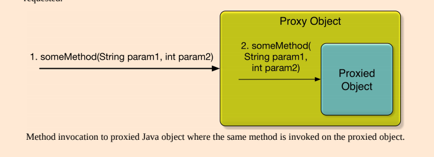

- Các lớp Proxy được tạo ra trong giai đoạn khởi tạo bởi các BeanPostProcessors chuyên dụng.
- Hai loại Proxy:
    - `JDK dynamic proxies`: tạo một đối tượng proxy thực thi tất cả các interface mà đối tượng cần proxy đã thực thi.
        - `@EnableAspectJAutoProxy`
        - Chỉ có thể proxy qua interface.
        - Bean cần proxy phải thực thi một interface Java.
        - Là một phần của JDK.
        - Tất cả các interface mà lớp thực thi đều bị proxy.
        - Dựa trên proxy thực thi các interface.
        - Các phương thức tìm thấy trong đối tượng target nhưng không có trong interface nào mà đối tượng target thực thi sẽ không thể bị proxy.
    - `CGLib proxies`: tạo một lớp con của lớp đối tượng cần proxy.
        - `@EnableAspectJAutoProxy(proxyTargetClass = true)`
        - Thư viện của bên thứ ba.
        - Cơ chế CGLIB proxy sẽ được sử dụng khi Spring AOP muốn tạo proxy cho một bean Spring mà không thực thi bất kỳ interface nào.
        - Có thể tạo proxy bằng cách kế thừa lớp. Trong trường hợp này, proxy trở thành lớp con của lớp target. Không cần interface.
        - Không phải là một phần của JDK, được bao gồm trong Spring.
        - Sử dụng khi lớp không thực thi interface.
        - Không thể áp dụng cho các lớp hoặc phương thức final.
        - Dựa trên proxy kế thừa lớp cơ sở.
        - Spring AOP có thể sử dụng CGLIB proxy dù đối tượng target có thực thi interface hay không.

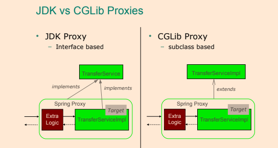

- Loại proxy mặc định được sử dụng bởi Spring framework là `JDK dynamic proxy`.
- Hạn chế của Proxy:
    - `JDK Dynamic Proxies`
        - Không hỗ trợ gọi lại chính nó (self-invocations).
        - Lớp mà proxy sẽ được tạo ra phải thực thi một interface.
        - Chỉ các phương thức công khai trong các interface được thực thi sẽ được proxy.
    - `CGLIB Proxies`
        - Không hỗ trợ gọi lại chính nó.
        - Lớp mà proxy sẽ được tạo ra không được phép là final.
        - Phương thức trong lớp mà proxy sẽ được tạo ra không được phép là final.
        - Chỉ các phương thức công khai và bảo vệ sẽ được proxy.
        - Cần một thư viện của bên thứ ba.
            - Không được tích hợp sẵn trong ngôn ngữ Java, do đó cần một thư viện.
            - Thư viện CGLIB đã được bao gồm trong Spring, nên khi sử dụng Spring, không cần thêm thư viện khác.

- Để kích hoạt việc phát hiện các Spring beans thực thi advice có lớp thực thi được chú thích với `@Aspect`, chú thích `@EnableAspectJAutoProxy` cần được áp dụng cho lớp `@Configuration` và các aspect phải được chú thích với `@Component`, tương tự như chức năng trong phần tử XML `<aop:aspectj-autoproxy>` của Spring.
- Để kích hoạt hỗ trợ `@AspectJ` với Java `@Configuration`, thêm chú thích `@EnableAspectJAutoProxy`.
- Khi sử dụng chú thích `@EnableAspectJAutoProxy`, thư viện `aspectjweaver.jar` từ AspectJ cần có trong classpath.
- AOP không phải là một phần của Spring core container.

```java
@Configuration
@EnableAspectJAutoProxy
public class AppConfig {

}
```

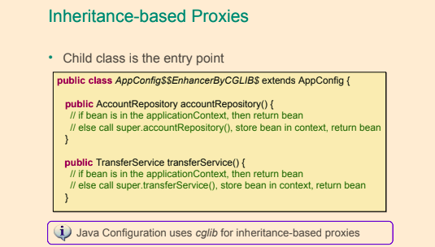

- Khi sử dụng proxy, giả sử phương thức a() gọi phương thức b() trên cùng một lớp/interface, advice sẽ không bao giờ được thực thi cho phương thức b().

```java
@Aspect
@Component
public class UserRepoMonitor {
    
    @Before("execution(public com.ps.repos.JdbcTemplateUserRepo+.findById(..))")
    public void beforeFindById(JoinPoint joinPoint) {
        String methodName = joinPoint.getSignature().getName();
        System.out.println(" ---> Phương thức " + methodName + " sắp được gọi");
    }
}
```

- Chú thích `@Before` được sử dụng với một tham số gọi là biểu thức pointcut. <br/>
  Điều này được sử dụng để xác định phương thức thực thi mà hành vi sẽ được áp dụng.

```java
@Configuration
@ComponentScan(basePackages = {"com.ps.repos.impl", "com.ps.aspects"})
@EnableAspectJAutoProxy
public class AppConfig {

}
```  

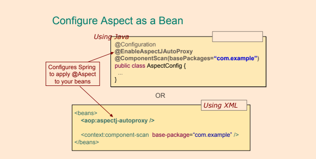

- `@EnableAspectJAutoProxy`: để kích hoạt hỗ trợ aspect, lớp cấu hình phải được chú thích, mặc định **JDK dynamic proxy**.
- `@EnableAspectJAutoProxy(proxyTargetClass = true)`: nếu thư viện **CGLIB** được thêm vào classpath của ứng dụng, Spring phải được thông báo rằng chúng ta muốn proxy dựa trên lớp con bằng cách sửa đổi chú thích kích hoạt aspect.
    - Phương pháp này phù hợp khi lớp mục tiêu không thực thi bất kỳ interface nào, vì vậy Spring sẽ tạo một lớp mới ngay lập tức là lớp con của lớp mục tiêu.
    - CGLIB phù hợp vì nó là một thư viện tạo mã byte.

- Rõ ràng là advice trước đã được thực thi, nhưng nó thực sự hoạt động như thế nào? Spring IoC tạo bean userTemplateRepo. Sau đó, định nghĩa aspect với một advice phải được thực thi trước phương thức findById thông báo với Spring rằng bean này phải được bao bọc trong một đối tượng proxy sẽ thêm hành vi bổ sung, và đối tượng này sẽ được tiêm thay thế cho đối tượng gốc mọi nơi cần thiết. Và vì chúng ta đang sử dụng JDK dynamic proxies, proxy sẽ thực thi interface `UserRepo`.

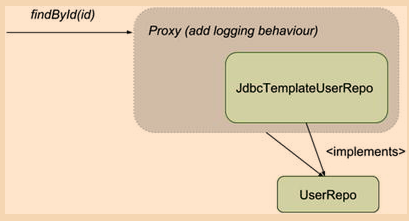

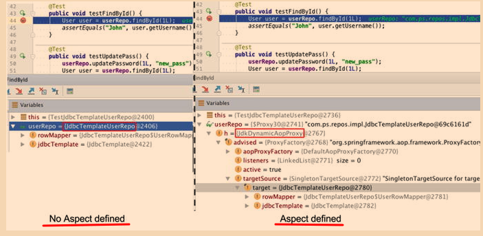

- Để sử dụng các aspect trong một ứng dụng Spring, bạn cần những điều sau:
    - `spring-aop` là một phụ thuộc.
    - Khai báo một lớp `@Aspect` và khai báo nó như một bean (sử dụng `@Component`, `@Bean` hoặc khai báo bean theo kiểu XML).
    - Khai báo một phương thức advice được chú thích với chú thích advice điển hình (`@Before`, `@After`, v.v.) và liên kết nó với một biểu thức pointcut.
    - Kích hoạt hỗ trợ aspect bằng cách chú thích lớp cấu hình với `@EnableAspectJAutoProxy`.
    - (Tùy chọn) Thêm CGLIB làm phụ thuộc và kích hoạt hỗ trợ aspect sử dụng proxy dựa trên lớp con bằng cách chú thích lớp cấu hình với `@EnableAspectJAutoProxy(proxyTargetClass = true)`.

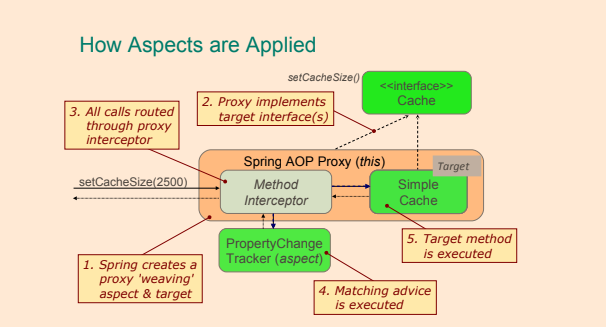

## Định Nghĩa Pointcuts

- Pointcuts có thể được kết hợp bằng các toán tử logic && (và), || (hoặc) và ! (không)
- Mẫu mà một biểu thức pointcut theo có thể được định nghĩa như sau:

```java
execution( [Modifiers] [ReturnType] [FullClassName].[MethodName] ([Arguments]) throws [ExceptionType])
```

- Biểu thức có thể chứa các ký tự đại diện như + và * và có thể bao gồm nhiều biểu thức nối với nhau bằng các toán tử boolean như &&(và), ||(hoặc), !(không) v.v.
    - Ký tự đại diện * thay thế bất kỳ nhóm ký tự nào
    - Ký tự đại diện + được sử dụng để chỉ ra rằng phương thức cần tư vấn cũng có thể được tìm thấy trong các lớp con được xác định bởi tiêu chí [FullClassName].
    - `!within(se.ivankrizsan.spring..*)` - sẽ chọn các join point không nằm trong gói se.ivankrizsan.spring hoặc bất kỳ gói con nào của nó.
    - * - Khớp với kiểu (kiểu trả về và kiểu tham số), tên đầy đủ hoặc một phần (gói, lớp, phương thức).
    - .. - Khớp với không hoặc nhiều tham số hoặc gói.

- Cũng có một danh sách các designators có thể được sử dụng để xác định phạm vi của pointcut; ví dụ, designator `within(...)` có thể được sử dụng để giới hạn pointcut cho một gói

```java
public * com.ps.repos.*.JdbcTemplateUserRepo+.findById(..)) && +underlinewithin(com.ps.*)
```

- Biểu thức pointcut có thể chỉ định chỉ các phương thức được định nghĩa trong một lớp được chú thích với một annotation cụ thể:

```java
execution(@org.springframework.transaction.annotation.Transactional public * com.ps.repos.*.*Repo+.findById(..)))
```

- Biểu thức pointcut thậm chí có thể chỉ định các phương thức trả về giá trị với một annotation cụ thể:

```java
execution(public (@org.springframework.stereotype.Service *) *(..)) 
```

- Bằng cách sử dụng designator `@annotation()`, chỉ các phương thức được chú thích với một annotation cụ thể có thể được xem xét:

```java
execution(public (public * com.ps.service.*.*Service+.*(..) && @annotation(org.springframework.security.access.annotation.Secured))
```

### Các Pointcut Designators

- Nếu sử dụng một pointcut designator không hỗ trợ của AspectJ với Spring AOP, sẽ ném ra một IllegalArgumentException.
- Pointcut designator: **execution**
    - **execution** pointcut designator khớp với các join point phương thức.
        - `Method visibility` <br/>
          Có thể là private, protected, public. Có thể phủ định bằng `!`. Có thể bỏ qua, trong trường hợp đó, tất cả các độ truy cập phương thức sẽ khớp.
        - `Return type` <br/>
          Kiểu đối tượng hoặc kiểu nguyên thủy. Có thể phủ định bằng `!`. Ký tự đại diện `*` có thể được sử dụng, trong trường hợp đó, tất cả các kiểu trả về sẽ được khớp.
        - `Package` <br/>
          Gói chứa các lớp. Có thể bỏ qua. Ký tự đại diện `..` có thể được sử dụng ở cuối tên gói để bao gồm tất cả các gói con. Ký tự đại diện `*` có thể được sử dụng trong tên gói.
        - `Class` <br/>
          Lớp chứa các phương thức sẽ được chọn. Có thể bỏ qua. Bao gồm cả các lớp con của lớp được chỉ định. Ký tự đại diện `*` có thể được sử dụng.
        - `Method` <br/>
          Tên phương thức mà các join point sẽ được chọn. Tên phương thức đầy đủ hoặc một phần. Ký tự đại diện `*` có thể được sử dụng, ví dụ “gree*” sẽ khớp với phương thức có tên greet và tất cả các phương thức khác có tên bắt đầu bằng “gree”.
        - `Parameters` <br/>
          Kiểu đối tượng hoặc kiểu nguyên thủy của tham số. Một kiểu tham số có thể phủ định bằng `!`, tức là `!int` sẽ khớp với bất kỳ kiểu nào ngoại trừ int. Ký tự đại diện `..` có thể được sử dụng để khớp với không hoặc nhiều tham số tiếp theo.
        - `Exceptions` <br/>
          Kiểu ngoại lệ mà phương thức khớp có thể ném ra. Một kiểu ngoại lệ có thể phủ định bằng `!`.

```java
execution(public String com.linnyk.spring.aopexamples.MySuperServiceImpl.*(String))

Pattern 
[method visibility] [return type] [package].[class].[method]([parameters] [throws exceptions])
```

- Pointcut designator: **within**
    - **within** pointcut designator khớp với các join point nằm trong một hoặc nhiều lớp, có thể chỉ định gói chứa lớp.
        - `Package` <br/>
          Gói chứa lớp sẽ được chọn. Có thể bỏ qua. Ký tự đại diện `..` có thể được sử dụng ở cuối tên gói để bao gồm tất cả các gói con. Ký tự đại diện `*` có thể được sử dụng trong tên gói.
        - `Class` <br/>
          Các lớp trong đó các join point sẽ được chọn. Ký tự đại diện `*` có thể được sử dụng. Các join point trong các lớp con của lớp được chỉ định cũng sẽ được khớp.

```java
within(se..MySuperServiceImpl)

Pattern
[package].[class]
```

- Pointcut designator: **this**
    - **this** pointcut designator khớp với tất cả các join point mà đối tượng hiện tại đang thực thi là của kiểu được chỉ định (lớp hoặc interface).
    - Mẫu chỉ định các join point sẽ được chọn chỉ gồm một kiểu duy nhất.
    - Ký tự đại diện không thể được sử dụng trong tên kiểu.
    - Biểu thức pointcut dưới đây sẽ khớp với các join point trong các đối tượng proxy thực thi interface `MySuperService`.

```java
this(MySuperService)
```

- Pointcut designator: **target**
    - **target** pointcut designator khớp với tất cả các join point mà đối tượng mục tiêu, ví dụ là đối tượng mà phương thức đang được gọi trên đó, có kiểu được chỉ định (lớp hoặc interface).

```java
target(MySuperServiceImpl)
```

- Pointcut designator: **args**
    - **args** pointcut designator khớp với các join point, trong việc thực thi phương thức Spring AOP, mà tham số là của kiểu được chỉ định.
        - Ký tự đại diện `..` có thể được sử dụng để chỉ định không hoặc nhiều tham số có kiểu bất kỳ.
        - Ký tự đại diện `*` có thể được sử dụng để chỉ định một tham số có kiểu bất kỳ.
        - Thông tin về gói có thể được bao gồm trong mẫu chỉ định các join point sẽ được chọn.
        - Ví dụ dưới đây chọn các join point mà tham số là hai số nguyên dài.
        - Ví dụ dưới đây chọn tất cả các join point mà tham số là của bất kỳ kiểu nào từ gói `java.util`.

```java
args(long, long)

args(java.util.*)
```

- Pointcut designator: **@target**
    - **@target** pointcut designator khớp với các join point trong các lớp được chú thích với annotation chỉ định.
    - Ví dụ dưới đây chọn tất cả các join point trong tất cả các lớp được chú thích với annotation `@Service` của Spring.

```java
@target(org.springframework.stereotype.Service)
```

- Pointcut designator: **@args**
    - **@args** pointcut designator khớp với các join point mà kiểu tham số (lớp) được chú thích với annotation chỉ định.
    - Lưu ý rằng không phải tham số cần được chú thích, mà là lớp.

```java
@args(com.linnyk.spring.aopexamples.CleanData)
```

- Pointcut designator: **@within**
    - **@within** pointcut designator khớp với các join point trong các lớp được chú thích với annotation chỉ định.

```java
@within(org.springframework.stereotype.Service)
```

- Pointcut designator: **@annotation**
    - **@annotation** pointcut designator khớp với các join point trong các phương thức được chú thích với annotation chỉ định.

```java
@annotation(com.linnyk.spring.aopexamples.MySuperSecurityAnnotation)
```

- Pointcut designator: **bean**
    - Designator này chọn tất cả các join point trong một Spring bean.
        - Ký tự đại diện `*` có thể được sử dụng trong mẫu, giúp có thể khớp một tập hợp các Spring beans bằng một biểu thức pointcut.
    - Biểu thức pointcut dưới đây sẽ chọn tất cả các join point trong Spring bean có tên `mySuperService`.

```java
bean(mySuperService)
```

## Triển khai Advice

**Aspect** = **PointCut**(Nơi Aspect được áp dụng) + **Advice**(Mã được thực thi)

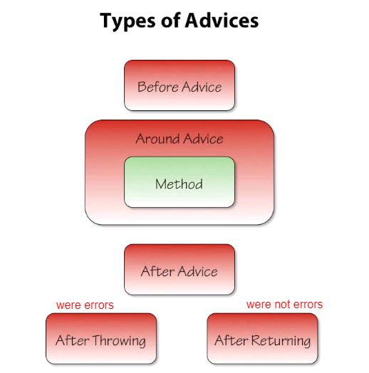

#### Trước

- Được thực thi trước một join point.
    - Không thể ngừng việc tiến hành đến join point trừ khi advice ném ra một ngoại lệ.
    - Ví dụ:
        - Kiểm soát truy cập (bảo mật) <br/>
          Cấp phép có thể được thực hiện bằng cách sử dụng before advice, ném ngoại lệ nếu người dùng hiện tại không được phép.
        - Thống kê <br/>
          Đếm số lần gọi của một join point.
- Before advice luôn tiếp tục đến join point trừ khi một ngoại lệ được ném từ trong mã advice.
- Việc sử dụng tham số `JoinPoint` trong advice là tùy chọn.

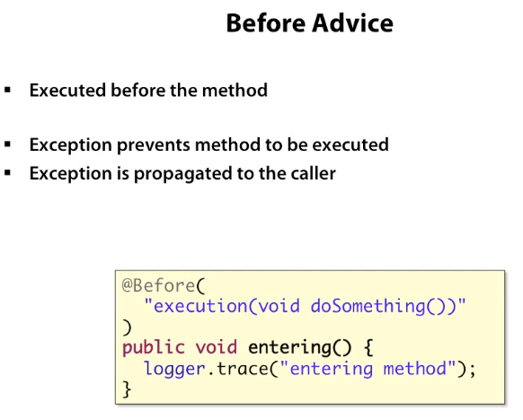

```java
@Before("com.ps.aspects.PointcutContainer.serviceUpdate(id, pass)")
public void beforeServiceUpdate (Long id, String pass) throws Throwable {
	//..
}
```

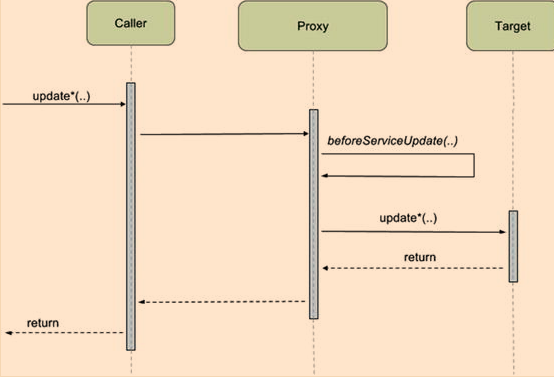

1. Đối tượng proxy nhận yêu cầu gọi đến bean đích và gọi trước phương thức advice.
2. Nếu phương thức advice thực thi thành công, yêu cầu ban đầu sẽ được chuyển tiếp đến bean đích và kết quả trả về cho caller.
3. Nếu phương thức advice ném một ngoại lệ, ngoại lệ đó sẽ được chuyển tiếp tới caller và phương thức đích sẽ không được thực thi.

#### Sau khi trả về

- Loại advice này chỉ được thực thi nếu phương thức đích thực thi thành công và không kết thúc bằng việc ném một ngoại lệ.
    - Ví dụ:
        - Thống kê <br/>
          Đếm số lần thực thi thành công của một join point.
        - Xác thực dữ liệu <br/>
          Kiểm tra dữ liệu được sinh ra từ phương thức được advice.

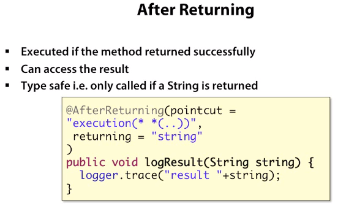

```java
@AfterReturning(value="execution (* com.ps.services.*Service+.update*(..))", returning = "result")
public void afterServiceUpdate(JoinPoint joinPoint, int result) throws Throwable {
	//..
}
```

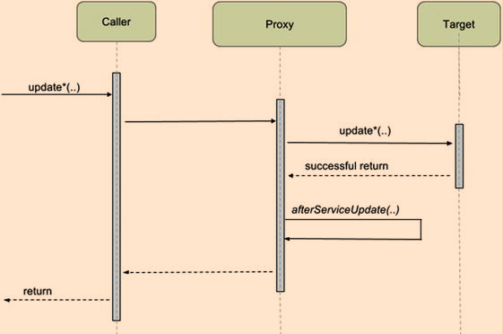

#### Sau khi ném ra ngoại lệ

- Được thực thi sau khi một join point kết thúc với việc ném ra một ngoại lệ.
    - Ví dụ:
        - Xử lý lỗi
        - Thống kê

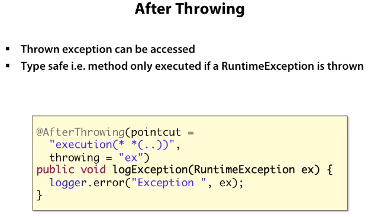

```java
@AfterThrowing(value="execution(* com.ps.services.*Service+.updateUsername(..))", throwing = "e")
public void afterBadUpdate(JoinPoint joinPoint, Exception e) throws Throwable {
	//..
}
```

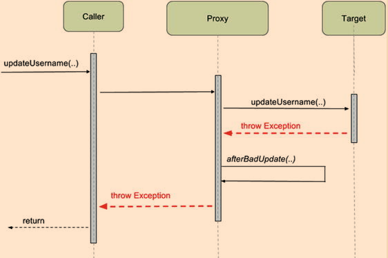

#### Sau

- Advice sau được thực thi sau khi phương thức đích kết thúc, bất kể thành công hay có ngoại lệ, và vì vậy, nó thích hợp để sử dụng cho việc kiểm toán hoặc ghi log.
    - Ví dụ:
        - Giải phóng tài nguyên. <br/>
          Tương tự như trong khối finally trong try-finally, after (finally) advice luôn được thực thi sau khi join point kết thúc và do đó có thể đảm bảo rằng tài nguyên luôn được giải phóng.

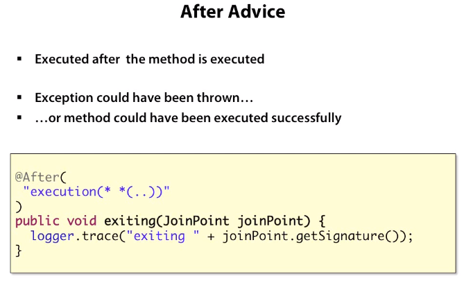

```java
@After("execution(public * com.ps.repos.*.JdbcTemplateUserRepo+.updateUsername(..))")
public void afterFindById(JoinPoint joinPoint) throws Throwable {
	//..
}
```

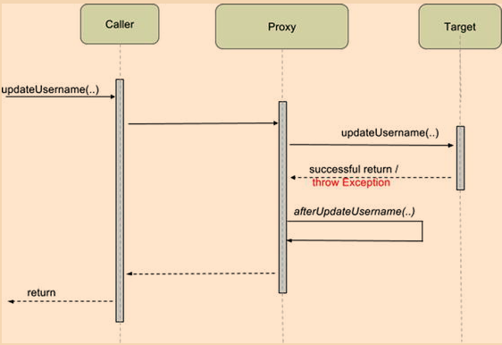

#### Around

- Around advice là loại advice mạnh mẽ nhất.
- Around advice có thể được sử dụng cho tất cả các trường hợp sử dụng của AOP.
- Có thể chọn có thực thi join point hay không.
- Có thể chọn trả về bất kỳ giá trị trả về nào từ việc thực thi join point hoặc trả về một giá trị khác.
- Được thực thi trước và sau (xung quanh) join point.
- Around advice là loại advice mạnh mẽ nhất, vì nó bao bọc phương thức đích và có quyền kiểm soát việc thực thi của nó, có nghĩa là advice quyết định liệu phương thức đích có được gọi hay không, và nếu có, thì khi nào.
- Loại `ProceedingJoinPoint` kế thừa từ `JoinPoint` và thêm phương thức `proceed()` được sử dụng để gọi phương thức đích.

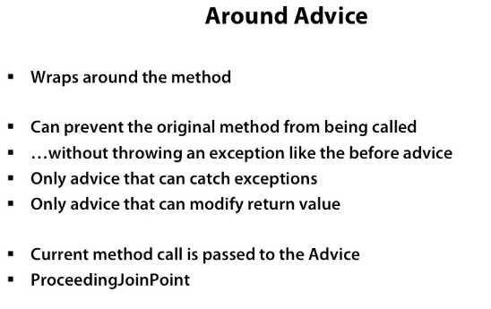

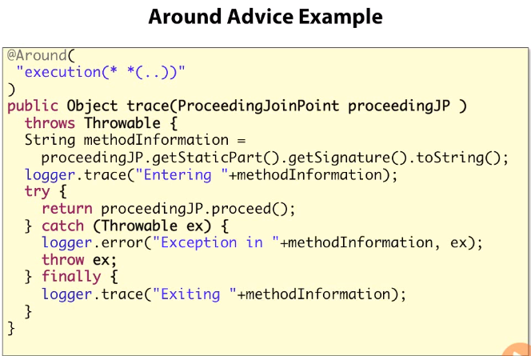

```java
@Around("execution(public * com.ps.repos.*.*Repo+.find*(..))")
public Object monitorFind( ProceedingJoinPoint joinPoint) throws Throwable {
	long t1 = System.currentTimeMillis();
	Thread.sleep(1000L);
	return joinPoint.proceed();
	long t2 = System.currentTimeMillis();
	logger.info(" ---> Execution of " + methodName + " took: "   + (t2 - t1) / 1000 + " ms.");
}
```

### JoinPoint

- `JoinPoint` có thể được thêm vào các phương thức triển khai các loại advice sau:
    - Before
    - After returning
    - After throwing
    - After
- Tham số này phải, nếu có, là tham số đầu tiên của phương thức advice.
- Khi advice được gọi, tham số này sẽ chứa một tham chiếu đến một đối tượng giữ thông tin tĩnh về join point cũng như thông tin trạng thái.
    - Ví dụ về thông tin tĩnh:
        - Loại (kind) của join point
        - Chữ ký tại join point
    - Ví dụ về thông tin động có thể lấy từ đối tượng `JoinPoint`:
        - Đối tượng mục tiêu - `JoinPoint.getTarget`
        - Đối tượng đang thực thi

### ProceedingJoinPoint

- Sử dụng lớp `ProceedingJoinPoint` làm tham số cho một advice kiểu `Around`.
- Loại này được sử dụng làm tham số đầu tiên của một phương thức triển khai một advice kiểu around.
- Lớp `ProceedingJoinPoint` là một lớp con của lớp `JoinPoint`, nó chứa tất cả thông tin đã mô tả trong phần trên về lớp `JoinPoint`.
- Lớp `ProceedingJoinPoint` chứa hai phương thức bổ sung:
    - **proceed()** <br/>
      Tiến hành để gọi phương thức advice tiếp theo hoặc phương thức đích mà không truyền bất kỳ tham số nào. Sẽ trả về một đối tượng. Có thể ném ra một ngoại lệ `Throwable`.
    - **proceed(Object[] args)** <br/>
      Tiến hành để gọi phương thức advice tiếp theo hoặc phương thức đích, truyền một mảng đối tượng làm tham số cho phương thức sẽ được gọi. Sẽ trả về một đối tượng. Có thể ném ra một ngoại lệ `Throwable`.

```java
@Around("publicServiceMethodInSpringPackagePointcut()")
public Object loggingAdvice(
	final ProceedingJoinPoint inProceedingJoinPoint) throws Throwable {
	System.out.printf("* Before service method '%s' invocation.%n", inProceedingJoinPoint.getSignature().toShortString());
	
	/* Gọi join point. */
	final Object theResult = inProceedingJoinPoint.proceed();
	System.out.printf("* After service method '%s' invocation.%n", inProceedingJoinPoint.getSignature().toShortString());
	return theResult;
}
```

Xin lỗi về sự thiếu sót đó. Dưới đây là bản dịch đầy đủ, bao gồm cả thông tin về hình ảnh:

## PointCuts

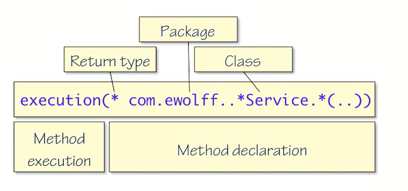

#### Wildcards

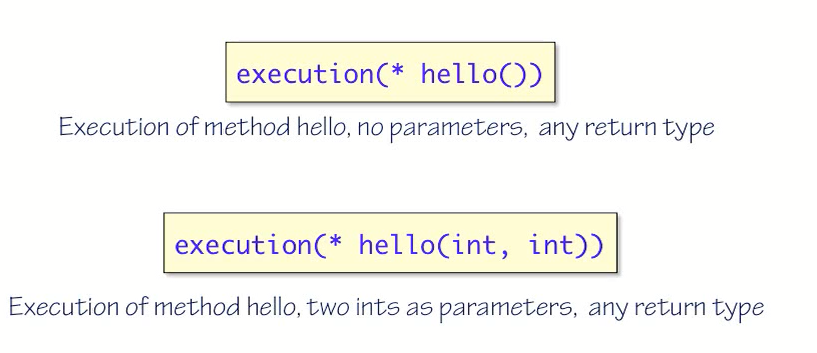

#### Parameter Wildcards

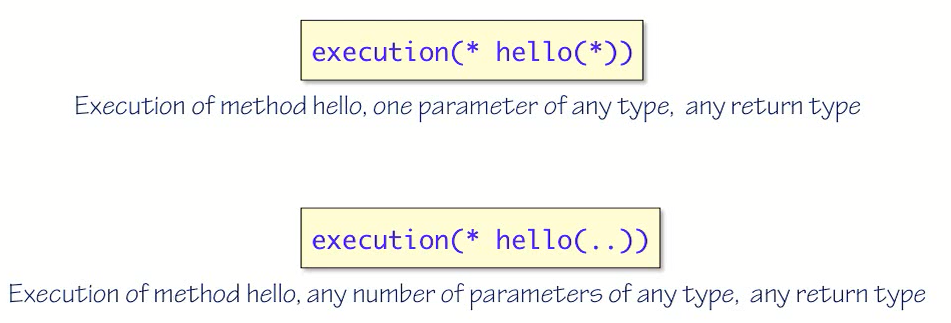

#### Packages and Classes

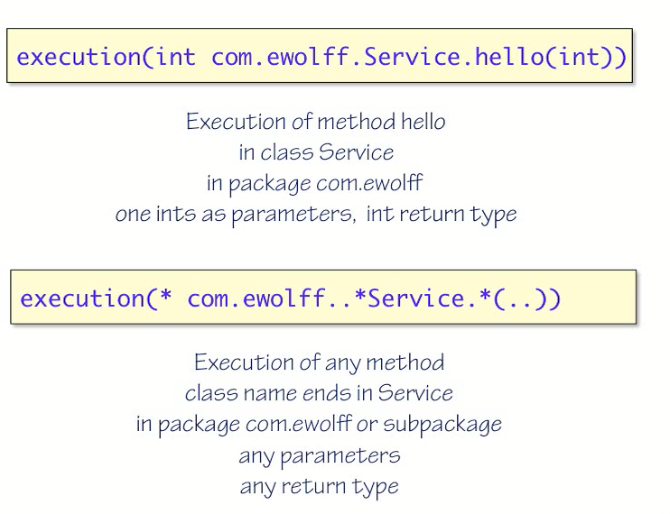

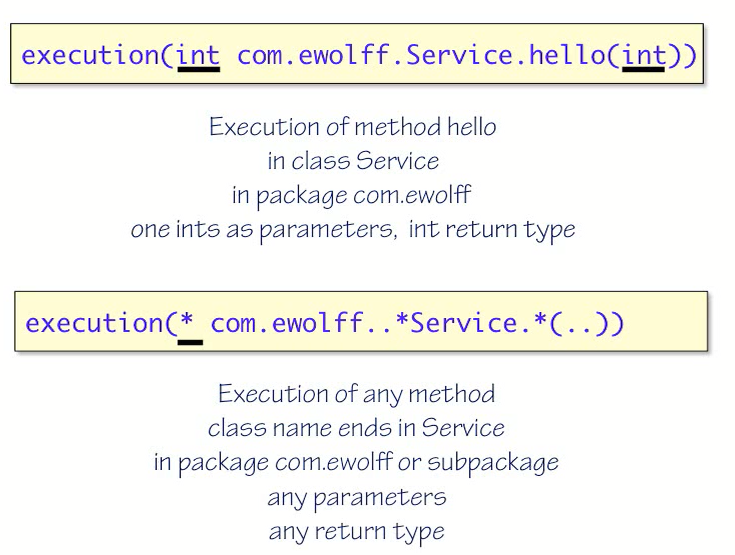

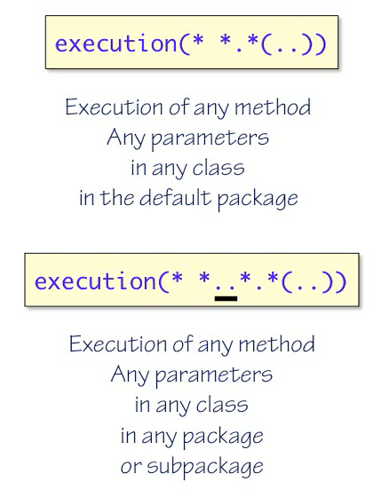

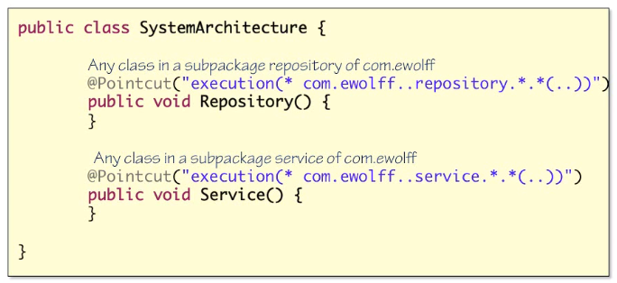

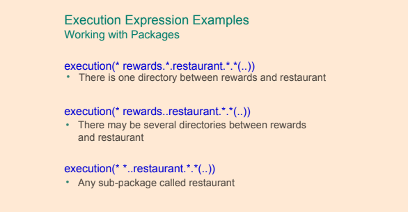

#### Annotation

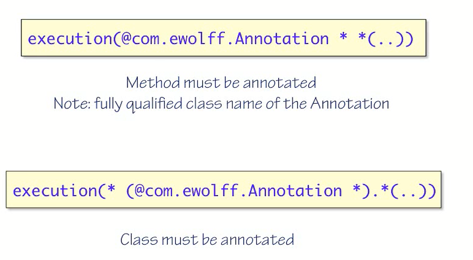

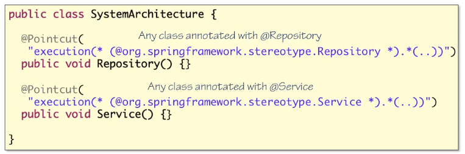

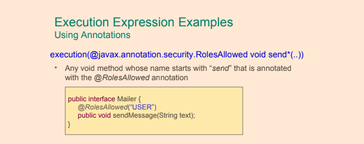

#### Spring beans names as PointCut

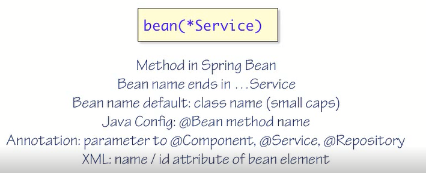

#### Boolean expressions in PointCut

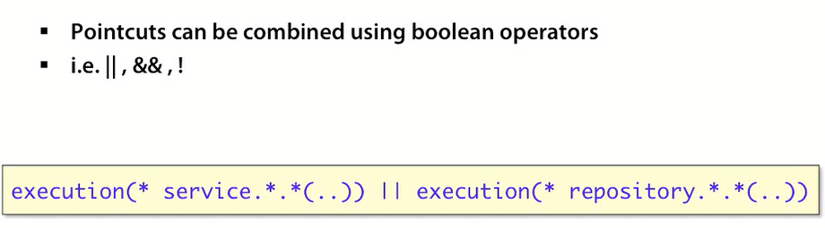

## @PointCut

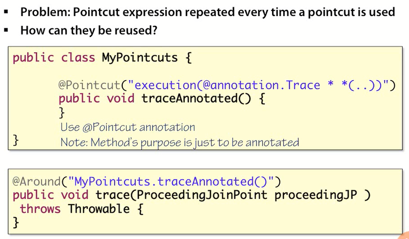

#### PointCuts XML

```xml
<aop:config>
    <aop:pointcut id="pointcut" expression="execution(void set*(*))"/> 
    
    <aop:aspect ref="myAspect">
        <aop:after-returning pointcut-ref="pointcut" method="logChange"/> 
    </aop:aspect> 
    
    <bean id="myAspect" class="com.example.MyAspect" />
</aop:config>
```

#### PointCuts Java

```java
//Pointcut is referenced here by its ID
@Before("setters()") 
public void logChange() {
    //...
}

//Method name is pointcut id, it is not executed
@Pointcut("execution(void set*(*))") 
public void setters() {
    //...
}
```

#### Context Selection

```java
public interface Server {
	public void start(Map input);
	public void stop();
}
```

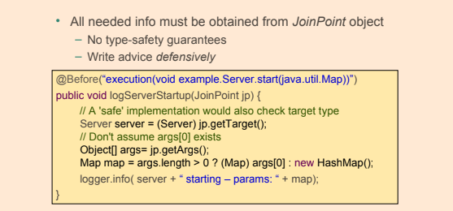

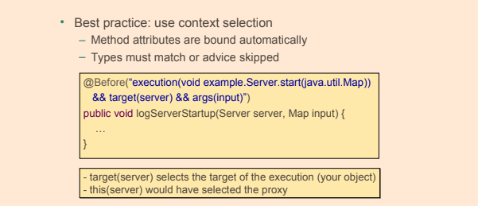