# Truy cập Dữ liệu

- **DML** là viết tắt của `Data Manipulation Language` (Ngôn ngữ thao tác dữ liệu), và các thao tác cơ sở dữ liệu đã được trình bày cho đến nay là một phần của nó, bao gồm các câu lệnh `SELECT`, `INSERT`, `UPDATE`, và `DELETE` được sử dụng để tạo, cập nhật hoặc xóa dữ liệu từ các bảng đã tồn tại.
- **DDL** là viết tắt của `Data Definition Language` (Ngôn ngữ định nghĩa dữ liệu), và các thao tác cơ sở dữ liệu thuộc về nó được sử dụng để thao tác với các đối tượng cơ sở dữ liệu: bảng, view, con trỏ, v.v. Các câu lệnh `CREATE`, `ALTER`, `DROP`.
- Lớp **DataAccessException** và tất cả các lớp con của nó trong Spring Framework.
    - Tất cả các ngoại lệ trong hệ thống ngoại lệ này đều là ngoại lệ không kiểm tra (unchecked).
    - Mục đích của hệ thống ngoại lệ truy cập dữ liệu là tách biệt các nhà phát triển ứng dụng khỏi các chi tiết của API truy cập dữ liệu JDBC, chẳng hạn như trình điều khiển cơ sở dữ liệu của các nhà cung cấp khác nhau.
    - Điều này giúp dễ dàng chuyển đổi giữa các API truy cập dữ liệu JDBC khác nhau.
    - Việc sử dụng nó giúp chuyển đổi các ngoại lệ được kiểm tra đặc thù của nhà cung cấp thành các ngoại lệ thời gian chạy.
    - Nó cho phép chuyển đổi dễ dàng giữa các công nghệ lưu trữ và giúp lập trình viên không phải lo lắng về việc bắt các ngoại lệ đặc thù của từng công nghệ.

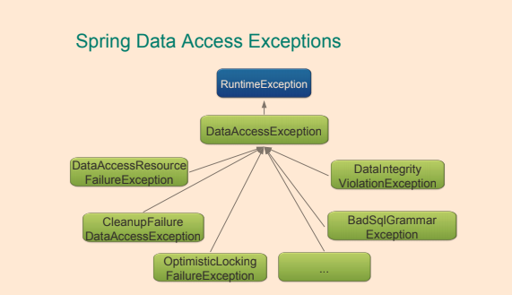

- Giao diện `javax.sql.DataSource` là giao diện từ đó tất cả các lớp nguồn dữ liệu liên quan đến SQL phát sinh.
    - DelegatingDataSource
    - AbstractDataSource
    - SmartDataSource
    - EmbeddedDatabase

- `DataSource` trong một ứng dụng độc lập

```java
@Bean
public DataSource dataSource() {
    final BasicDataSource theDataSource = new BasicDataSource();
    theDataSource.setDriverClassName("org.hsqldb.jdbcDriver");
    theDataSource.setUrl("jdbc:hsqldb:hsql://localhost:1234/mydatabase");
    theDataSource.setUsername("ivan");
    theDataSource.setPassword("secret");
    return theDataSource;
}
```

- `DataSource` trong Spring Boot, không cần tạo bean `DataSource`.
- Chỉ cần thiết lập một vài thuộc tính là đủ:

```xml
spring.datasource.url= jdbc:hsqldb:hsql://localhost:1234/mydatabase
spring.datasource.username=ivan
spring.datasource.password=secret
```

- `DataSource` trong ứng dụng triển khai trên máy chủ
    - Nếu ứng dụng được triển khai trên máy chủ ứng dụng, một cách để có được nguồn dữ liệu là thực hiện tìm kiếm JNDI:
  ```java
  @Bean
  public DataSource dataSource() {
      final JndiDataSourceLookup theDataSourceLookup = new JndiDataSourceLookup();
      final DataSource theDataSource =
      theDataSourceLookup.getDataSource("java:comp/env/jdbc/MyDatabase");
      return theDataSource;
  }
  ```
    - Các ứng dụng Spring Boot chỉ cần dựa vào việc thiết lập một thuộc tính duy nhất:
  ```xml
  spring.datasource.jndi-name=java:comp/env/jdbc/MyDatabase
  ```

## Cấu hình Java của DataSource và điền dữ liệu vào cơ sở dữ liệu

```java
@Configuration
@Profile("dev")
@PropertySource("classpath:db/db.properties")
public class TestDataConfig {
	
	@Value("${driverClassName}")
	private String driverClassName;
	
	@Value("${url}")
	private String url;
	
	@Value("${username}")
	private String username;
	
	@Value("${password}")
	private String password;
	
	@Value("classpath:db/schema.sql")
	private Resource schemaScript;
	
	@Value("classpath:db/test-data.sql")
	private Resource dataScript;
        
    @Bean
    public static PropertySourcesPlaceholderConfigurer propertySourcesPlaceholderConfigurer() {
      return new PropertySourcesPlaceholderConfigurer();
    }
    
    @Lazy
    @Bean
    public DataSource dataSource() {
        try {
            SimpleDriverDataSource dataSource = new SimpleDriverDataSource();
            Class<? extends Driver> driver = (Class<? extends Driver>) Class.forName(driverClassName);
            dataSource.setDriverClass(driver);
            dataSource.setUrl(url);
            dataSource.setUsername(username);
            dataSource.setPassword(password);
            DatabasePopulatorUtils.execute(databasePopulator(), dataSource);
            return dataSource;
        } catch (Exception e) {
            return null;
        }
    }
    
    @Bean
    public DataSourceInitializer dataSourceInitializer (final DataSource dataSource) {
        final DataSourceInitializer initializer = new DataSourceInitializer();
        initializer.setDataSource(dataSource);
        initializer.setDatabasePopulator(databasePopulator());
        return initializer;
    }
    
    private DatabasePopulator databasePopulator() {
        final ResourceDatabasePopulator populator = new ResourceDatabasePopulator();
        populator.addScript(schemaScript);
        populator.addScript(dataScript);
        return populator;
    }
    
    @Bean
    public JdbcTemplate userJdbcTemplate() {
        return new JdbcTemplate(dataSource());
    }
}
```

#### Cấu hình Java của Embedded DataSource

- Đặc biệt hữu ích cho việc kiểm tra
- Hỗ trợ H2, HSQL và Derby

```java
@Configuration
@Profile("dev")
public class TestDataConfig {

    @Bean
    public DataSource dataSource() {
        return new EmbeddedDatabaseBuilder()
                .setType(EmbeddedDatabaseType.H2)
                .addScript("classpath:db/schema.sql")
                .addScript("classpath:db/test-data.sql")
                .build();
    }

}
```

#### Cấu hình XML của Embedded DataSource

- Đặc biệt hữu ích cho việc kiểm tra
- Hỗ trợ H2, HSQL và Derby

```xml
<jdbc:embedded-database id="dataSource">
	 <jdbc:script location="classpath:db/schema.sql"/>
	 <jdbc:script location="classpath:db/test-data.sql"/>
</jdbc:embedded-database>
```

## Spring Cache

- Chú thích `@Cacheable` là một trong những chú thích quan trọng và phổ biến nhất để lưu trữ bộ nhớ cache các yêu cầu. Nếu các nhà phát triển đánh dấu một phương thức với chú thích `@Cacheable` và ứng dụng nhận được nhiều yêu cầu, thì chú thích này sẽ không thực thi phương thức nhiều lần mà thay vào đó sẽ trả về kết quả từ bộ nhớ cache.
- Chú thích `@CachePut` giúp cập nhật bộ nhớ cache với kết quả thực thi mới nhất mà không dừng việc thực thi phương thức. Sự khác biệt chính giữa `@Cacheable` và `@CachePut` là `@Cacheable` sẽ bỏ qua việc thực thi phương thức, trong khi `@CachePut` sẽ thực thi phương thức và sau đó đưa kết quả vào bộ nhớ cache.
- Cần phải chỉ định một `cache-manager`

```java
@Configuration
@ComponentScan("com.learning.linnyk")
@EnableCaching
public class AppConfig {

	@Bean
	public CacheManager cacheManager() {
		final SimpleCacheManager cacheManager = new SimpleCacheManager();
		cacheManager.setCaches(Arrays.asList(new ConcurrentMapCache("cities")));
		return cacheManager;
	}

}
```

- Đối với mỗi tên bộ nhớ cache, nó sẽ tạo ra một `ConcurrentHashMap`
- Các lựa chọn thay thế của bên thứ ba
    - Terracotta's `EhCache`
    - Google's `Guava` và `Caffeine`
    - Pivotal's `Gemfire`

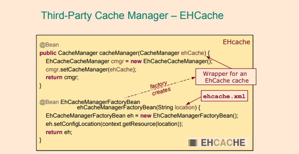

```java
@Service
public class CitiesService {

	private CitiesRepository citiesRepository;

	@Autowired
	public CitiesService(CitiesRepository citiesRepository) {
		this.citiesRepository = citiesRepository;
	}

	@Cacheable(value = "cities") 
	public City getCityByIdCacheable(long id) {
		return citiesRepository.getCityById(id);
	}

	@CachePut(value = "cities")
	public City getCityByIdCachePut(long id) {
		return citiesRepository.getCityById(id);
	}
}
```

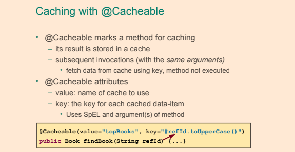

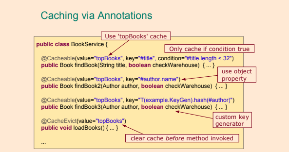

### ACID

- **Atomicity**: Các thay đổi trong một giao dịch phải được áp dụng toàn bộ hoặc không áp dụng gì cả. "Tất cả hoặc không gì cả".
- **Consistency**: Các ràng buộc toàn vẹn, ví dụ như của cơ sở dữ liệu, không bị vi phạm.
- **Isolation**: Các giao dịch được cô lập với nhau và không ảnh hưởng đến nhau.
- **Durability**: Đặc tính của một giao dịch phải tồn tại ngay cả khi có sự cố như mất điện, sự cố hệ thống và các lỗi khác.

### Môi trường Giao dịch

- Một giao dịch là một thao tác bao gồm nhiều tác vụ và được thực hiện như một đơn vị duy nhất – hoặc tất cả các tác vụ được thực hiện hoặc không có tác vụ nào được thực hiện. Nếu một tác vụ trong giao dịch không hoàn thành thành công, các tác vụ còn lại trong giao dịch sẽ không được thực hiện hoặc, đối với các tác vụ đã được thực hiện, chúng sẽ bị hoàn lại.

- Trong một môi trường giao dịch, các giao dịch phải được quản lý. <br/>
  Trong Spring, việc này được thực hiện thông qua một bean hạ tầng gọi là `transaction manager`.

- Cấu hình hành vi giao dịch được thực hiện một cách khai báo thông qua việc đánh dấu các phương thức với chú thích `@Transactional`.
- Cần sử dụng `@Transactional` trên các lớp repository để đảm bảo hành vi giao dịch.
- Các phương thức cần được thực thi trong bối cảnh giao dịch sẽ được đánh dấu với chú thích `@Transactional`.
- Chú thích này phải chỉ được sử dụng trên các phương thức public; nếu không, proxy giao dịch sẽ không thể áp dụng hành vi giao dịch.
- Chú thích tiêu chuẩn `javax.transaction.Transactional` cũng được hỗ trợ như một sự thay thế dễ dàng cho chú thích của Spring.

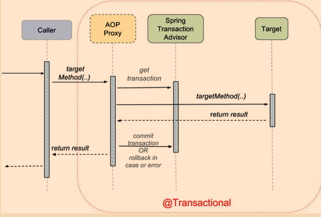

#### Sự khác biệt giữa giao dịch cục bộ và giao dịch toàn cầu

- Giao dịch toàn cầu cho phép các giao dịch trải rộng qua nhiều tài nguyên giao dịch. Ví dụ, xem xét một giao dịch toàn cầu trải rộng qua một thao tác cập nhật cơ sở dữ liệu và việc đăng bài lên hàng đợi của một message broker. Nếu thao tác cơ sở dữ liệu thành công nhưng việc đăng bài lên hàng đợi thất bại, thì thao tác cơ sở dữ liệu sẽ bị hoàn lại (undo).

- Giao dịch cục bộ là giao dịch chỉ liên quan đến một tài nguyên duy nhất, chẳng hạn như một cơ sở dữ liệu đơn lẻ hoặc một hàng đợi của message broker, nhưng không phải cả hai trong cùng một giao dịch.

## Cấu hình hỗ trợ giao dịch

- Cấu hình hỗ trợ quản lý giao dịch
    - Thêm khai báo một bean loại `org.springframework.jdbc.datasource.DataSourceTransactionManager`
        - Lớp `DataSourceTransactionManager` là một triển khai của `PlatformTransactionManager` cho các nguồn dữ liệu JDBC đơn lẻ.
          Nó gắn kết một kết nối JDBC từ nguồn dữ liệu đã chỉ định với luồng hiện tại đang thực thi, cho phép mỗi luồng có thể kết nối với một nguồn dữ liệu.
    - Sử dụng `<tx:annotation-driven ../>`

```xml
<bean id="transactionManager"
         class="org.springframework.jdbc.datasource.DataSourceTransactionManager">
         <property name="dataSource" ref="dataSource"/>
</bean>

<tx:annotation-driven transaction-manager="transactionManager"/>
```

```java
public class TestDataConfig {

    @Bean
    public PlatformTransactionManager txManager(){
        return new DataSourceTransactionManager(dataSource());
    }
}
```

- Áp dụng chú thích `@EnableTransactionManagement` cho một lớp `@Configuration` duy nhất trong ứng dụng.
- `@EnableTransactionManagement` có thể được sử dụng để giúp chú thích `@Transactional` trong mã nguồn hoạt động.

```java
@Configuration
@EnableTransactionManagement
@ComponentScan(basePackages = {"com.ps.repos.impl", "com.ps.services.impl"})
public class AppConfig {
    
}
```

- Khai báo các phương thức giao dịch
    - Phương thức cần thực thi trong một giao dịch phải được đánh dấu bằng chú thích `@Transactional` của Spring.

```java
@Transactional
@Override
public User findById(Long id) {
	return userRepo.findById(id);
}
```

- Chú thích `@Transactional` cũng có thể được sử dụng ở cấp lớp.
  Trong trường hợp này, tất cả các phương thức trong lớp sẽ trở thành các phương thức giao dịch và tất cả các thuộc tính định nghĩa cho giao dịch sẽ được kế thừa từ định nghĩa cấp lớp `@Transactional`.

- Cả `@EnableTransactionManagement` và `<tx:annotation-driven ../>` đều kích hoạt tất cả các bean hạ tầng cần thiết để hỗ trợ việc thực thi giao dịch.
  Tuy nhiên, có một sự khác biệt nhỏ giữa chúng. Phần tử cấu hình XML có thể được sử dụng như sau: `<tx:annotation-driven />` mà không cần thuộc tính `transaction-manager`.
  Trong trường hợp này, Spring sẽ tìm kiếm một bean có tên là `transactionManager` theo mặc định, và nếu không tìm thấy, ứng dụng sẽ không khởi động.
  `@EnableTransactionManagement` linh hoạt hơn; nó tìm kiếm một bean có loại bất kỳ thực thi `org.springframework.transaction.PlatformTransactionManager`, vì vậy tên của nó không quan trọng.

## @Transactional

- **@Transactional** là chú thích được sử dụng cho `quản lý giao dịch khai báo` và có thể được sử dụng cả ở cấp lớp và cấp phương thức trong các lớp và giao diện.
- Trong Spring, quản lý giao dịch khai báo được thực hiện thông qua Spring AOP.
- Khi sử dụng proxy Spring AOP, chỉ các phương thức công khai (`public`) với chú thích `@Transactional` mới có tác dụng. Việc áp dụng `@Transactional` cho các phương thức bảo vệ (`protected`), riêng tư (`private`) hoặc có phạm vi gói (`package visibility`) sẽ không gây lỗi nhưng không mang lại hiệu quả quản lý giao dịch như mong muốn.

### Các tham số của `@Transactional`:
- `transactionManager` - Quản lý giao dịch được sử dụng để quản lý giao dịch trong ngữ cảnh của phương thức được chú thích.
- `readOnly` - Dành cho các giao dịch không thay đổi cơ sở dữ liệu (ví dụ: tìm kiếm, đếm bản ghi).
    - Cho phép Spring tối ưu hóa tài nguyên giao dịch cho việc truy cập dữ liệu chỉ đọc.
    - Giao dịch chỉ đọc ngăn Hibernate không thực hiện việc làm sạch phiên làm việc. Hibernate sẽ không áp dụng kiểm tra thay đổi, do đó tăng hiệu suất.
    - Khi giao dịch JDBC được đánh dấu là chỉ đọc, Oracle chỉ chấp nhận các câu lệnh SQL `SELECT`.
- `propagation` - Phương thức lan truyền giao dịch. `org.springframework.transaction.annotation.Propagation`.
- `isolation` - Mức độ cô lập của giao dịch. `org.springframework.transaction.annotation.Isolation`.
- `timeout` - Số mili giây sau khi giao dịch bị coi là thất bại.
- `rollbackFor` - Khi loại ngoại lệ này được ném ra trong quá trình thực thi phương thức giao dịch, giao dịch sẽ được hoàn tác.
- `rollbackForClassName` - Tên các lớp ngoại lệ gây ra việc hoàn tác giao dịch.
- `noRollbackFor` - Các lớp ngoại lệ không gây hoàn tác giao dịch.
- `noRollbackForClassName` - Tên các lớp ngoại lệ không bao giờ gây ra hoàn tác giao dịch.

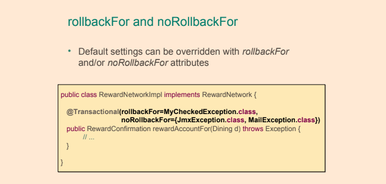

- Spring cho phép sử dụng chú thích `javax.transaction.Transactional` của JPA thay thế cho chú thích `@Transactional` của Spring, mặc dù nó không có nhiều tùy chọn cấu hình.
- Nếu một phương thức `@Transactional` gọi phương thức `@Transactional` khác, phương thức đó sẽ thực thi trong cùng một ngữ cảnh giao dịch của phương thức đầu tiên.
- Quản lý giao dịch khai báo
    - Được thực hiện thông qua chú thích hoặc cấu hình XML của Spring.
- Chính sách hoàn tác
    - Chính sách hoàn tác mặc định của quản lý giao dịch Spring là hoàn tác tự động chỉ xảy ra khi có một ngoại lệ không kiểm soát được (`unchecked exception`) được ném ra.
    - Các loại ngoại lệ sẽ gây ra hoàn tác có thể được cấu hình thông qua phần tử `rollbackFor` trong chú thích `@Transactional`. Ngoài ra, các loại ngoại lệ không gây hoàn tác cũng có thể được cấu hình thông qua phần tử `noRollbackFor`.
    - Nếu một phương thức kiểm tra được chú thích với `@Test` cũng được chú thích với `@Transactional`, thì phương thức kiểm tra sẽ được thực thi trong một giao dịch. Giao dịch này sẽ tự động được hoàn tác sau khi phương thức kiểm tra hoàn thành.
        - Chính sách hoàn tác của kiểm tra có thể được thay đổi bằng cách sử dụng chú thích `@Rollback` và đặt giá trị là `false`.
- Đối tượng mục tiêu được bao bọc trong một proxy
    - Sử dụng một **Around** advice.
- Proxy thực thi các hành vi sau:
    - Giao dịch bắt đầu trước khi vào phương thức.
    - Cam kết giao dịch khi kết thúc phương thức.
    - Hoàn tác giao dịch nếu phương thức ném ra:
        - `java.lang.RuntimeException`
        - Ngoại lệ không kiểm soát (`unchecked exception`)
        - `java.lang.Error`
- Theo mặc định, giao dịch sẽ được hoàn tác nếu một `RuntimeException` được ném ra.
- `@Transactional("myOtherTransactionManager")` - Chạy giao dịch với các quản lý giao dịch cụ thể.

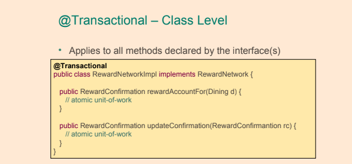

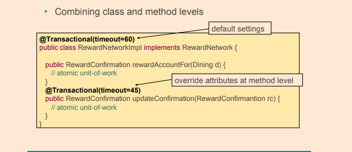


### PlatformTransactionManager

- `PlatformTransactionManager` là giao diện cơ sở cho tất cả các quản lý giao dịch có thể sử dụng trong cơ sở hạ tầng giao dịch của Spring.
    - Giao diện `PlatformTransactionManager` bao gồm các phương thức sau:
        - `void commit(TransactionStatus)`
        - `void rollback(TransactionStatus)`
        - `TransactionStatus getTransaction(TransactionDefinition)`

### Sử dụng PlatformTransactionManager

- Tên giao dịch có thể được thiết lập một cách rõ ràng chỉ thông qua cách lập trình.

```java
DefaultTransactionDefinition def = new DefaultTransactionDefinition();
// Thiết lập tên giao dịch một cách rõ ràng chỉ có thể thực hiện qua cách lập trình
def.setName("SomeTxName");
def.setPropagationBehavior(TransactionDefinition.PROPAGATION_REQUIRED);

TransactionStatus status = txManager.getTransaction(def);
try {
    // Thực thi logic nghiệp vụ ở đây
}
catch (MyException ex) {
    txManager.rollback(status);
    throw ex;
}
txManager.commit(status);
```

### Giao dịch lập trình với TransactionTemplate

- **Ví dụ 1**

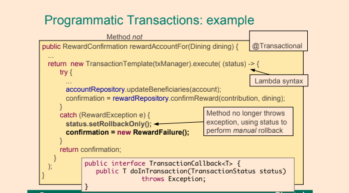

- **Ví dụ 2**

```java
@Service
public class ProgramaticUserService implements UserService {

    private UserRepo userRepo;

    private TransactionTemplate txTemplate;

    @Autowired
    public ProgramaticUserService(UserRepo userRepo, PlatformTransactionManager txManager) {
        this.userRepo = userRepo;
        this.txTemplate = new TransactionTemplate(txManager);
    }

    @Override
    public int updatePassword(Long userId, String newPass) throws MailSendingException {
        return txTemplate.execute(status -> {
            try {
                int result = userRepo.updatePassword(userId, newPass);
                User user = userRepo.findById(userId);
                String email = user.getEmail();
                sendEmail(email);
                return result;
            } catch (MailSendingException e) {
                status.setRollbackOnly();
            }
            return 0;
        });
    }
}
```

### @EnableTransactionManagement

- Chú thích `@EnableTransactionManagement` được sử dụng để chú thích chính xác một lớp cấu hình trong ứng dụng nhằm kích hoạt quản lý giao dịch theo kiểu khai báo thông qua chú thích `@Transactional`.
    - Các thành phần được đăng ký khi sử dụng chú thích `@EnableTransactionManagement`:
        - `TransactionInterceptor`.
            - Chặn các cuộc gọi đến phương thức `@Transactional`, tạo giao dịch mới khi cần thiết, v.v.
            - Quản lý giao dịch khai báo của Spring sử dụng lớp `TransactionInterceptor` trong proxy AOP của nó để áp dụng lời khuyên về giao dịch.
        - Proxy JDK hoặc lời khuyên AspectJ. <br/>
          Lời khuyên này chặn các phương thức được chú thích `@Transactional` (hoặc các phương thức nằm trong lớp được chú thích `@Transactional`).
    - Chú thích `@EnableTransactionManagement` có ba phần tử tùy chọn sau:
        - `mode` <br/>
          Cho phép chọn loại lời khuyên cần sử dụng cho giao dịch. Các giá trị có thể là `AdviceMode.ASPECTJ` và `AdviceMode.PROXY`, với mặc định là `AdviceMode.PROXY`.
        - `order` <br/>  
          Thứ tự của lời khuyên giao dịch khi có nhiều lời khuyên được áp dụng cho một join-point. Giá trị mặc định là `Ordered.LOWEST_PRECEDENCE`.
        - `proxyTargetClass` <br/>
          Đặt giá trị `true` nếu muốn sử dụng proxy CGLIB, `false` nếu muốn sử dụng proxy dựa trên giao diện JDK trong ứng dụng.

## Propagation Giao dịch

- Xảy ra khi mã từ một giao dịch gọi một giao dịch khác.
- Propagation giao dịch xác định liệu tất cả các thao tác có nên chạy trong một giao dịch duy nhất hay sử dụng giao dịch lồng nhau.
- Có 7 mức độ propagation.
- 2 mức cơ bản là **REQUIRED** và **REQUIRES_NEW**.

### org.springframework.transaction.annotation.Propagation

- **REQUIRED**: Sử dụng một giao dịch hiện tại nếu có, hoặc một giao dịch mới sẽ được tạo ra để thực thi phương thức được chú thích với `@Transactional(propagation = Propagation.REQUIRED)`.
- **REQUIRES_NEW**: Một giao dịch mới sẽ được tạo ra để thực thi phương thức được chú thích với `@Transactional(propagation = Propagation.REQUIRES_NEW)`. Nếu có giao dịch hiện tại, nó sẽ bị tạm ngưng.
- **NESTED**: Sử dụng một giao dịch lồng nhau hiện có để thực thi phương thức được chú thích với `@Transactional(propagation = Propagation.NESTED)`. Nếu không có giao dịch lồng nhau nào, một giao dịch mới sẽ được tạo ra.
- **MANDATORY**: Phải sử dụng một giao dịch hiện có để thực thi phương thức được chú thích với `@Transactional(propagation = Propagation.MANDATORY)`. Nếu không có giao dịch, một ngoại lệ sẽ được ném ra.
- **NEVER**: Các phương thức được chú thích với `@Transactional(propagation = Propagation.NEVER)` không được phép thực thi trong một giao dịch. Nếu có giao dịch, một ngoại lệ sẽ được ném ra.
- **NOT_SUPPORTED**: Không sử dụng giao dịch để thực thi phương thức được chú thích với `@Transactional(propagation = Propagation.NOT_SUPPORTED)`. Nếu có giao dịch, nó sẽ bị tạm ngưng.
- **SUPPORTS**: Sử dụng một giao dịch hiện có nếu có, để thực thi phương thức được chú thích với `@Transactional(propagation = Propagation.SUPPORTS)`. Nếu không có giao dịch, phương thức sẽ được thực thi mà không có ngữ cảnh giao dịch.

## Các Mức Độ Cách Ly Giao Dịch

- **Cách ly giao dịch** trong hệ thống cơ sở dữ liệu xác định cách các thay đổi trong một giao dịch được nhìn thấy bởi các người dùng và hệ thống khác truy cập cơ sở dữ liệu trước khi giao dịch được cam kết.
- Có 4 mức độ cách ly giao dịch (từ ít nghiêm ngặt đến nghiêm ngặt nhất):
    - **READ_UNCOMMITTED**
    - **READ_COMMITTED**
    - **REPEATABLE_READ**
    - **SERIALIZABLE**
- Không phải tất cả các mức độ cách ly đều được hỗ trợ trong tất cả các cơ sở dữ liệu.
- Các cơ sở dữ liệu khác nhau có thể triển khai cách ly theo những cách hơi khác nhau.

### org.springframework.transaction.annotation.Isolation

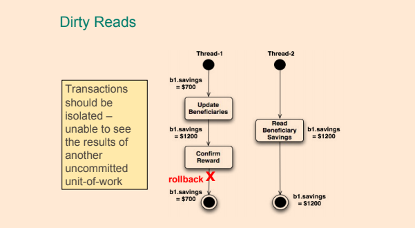

- **DEFAULT**: mức độ cách ly mặc định của hệ quản trị cơ sở dữ liệu (DBMS).
- **READ_UNCOMMITTED**: dữ liệu thay đổi bởi một giao dịch có thể được đọc bởi một giao dịch khác trong khi giao dịch đầu tiên chưa cam kết, còn được gọi là **dirty reads**.
  `Dirty reads có thể xảy ra.`
- **READ_COMMITTED**: không thể có **dirty reads** khi một giao dịch sử dụng mức độ cách ly này.
  Đây là chiến lược mặc định cho hầu hết các cơ sở dữ liệu. Tuy nhiên, một hiện tượng khác có thể xảy ra ở đây là **repeatable read**: khi một truy vấn giống nhau được thực hiện nhiều lần, có thể nhận được các kết quả khác nhau. (Ví dụ: một người dùng được truy xuất lặp lại trong cùng một giao dịch. Trong khi đó, một giao dịch khác chỉnh sửa người dùng và cam kết. Nếu giao dịch đầu tiên có mức cách ly này, nó sẽ trả lại người dùng với các thuộc tính mới sau khi giao dịch thứ hai được cam kết.)
  `Phantom reads và non-repeatable reads có thể xảy ra`.
- **REPEATABLE_READ**: mức độ cách ly này không cho phép **dirty reads**, và việc truy vấn lại một dòng trong cùng một giao dịch sẽ luôn trả về kết quả giống nhau, ngay cả khi giao dịch khác đã thay đổi dữ liệu trong khi việc đọc đang diễn ra. Quá trình đọc lại cùng một dòng nhiều lần trong bối cảnh giao dịch và luôn nhận được kết quả giống nhau được gọi là **repeatable read**.
  `Phantom reads có thể xảy ra`.
- **SERIALIZABLE**: đây là mức độ cách ly nghiêm ngặt nhất, vì các giao dịch được thực thi theo cách tuần tự. Vì vậy, không có **dirty reads**, **non-repeatable reads**, và **phantom reads** có thể xảy ra. Một **phantom read** xảy ra khi trong quá trình giao dịch, việc thực thi các truy vấn giống nhau có thể dẫn đến các tập hợp kết quả khác nhau được trả về.

#### **READ_UNCOMMITTED**
- `@Transactional(isolation = Isolation.READ_UNCOMMITTED)`
- Mức độ cách ly thấp nhất.
- **Dirty reads** có thể xảy ra - một giao dịch có thể thấy dữ liệu chưa cam kết của giao dịch khác.
- Có thể khả thi cho các giao dịch lớn hoặc dữ liệu thay đổi thường xuyên.

#### **READ_COMMITTED**
- `@Transactional(isolation = Isolation.READ_COMMITTED)`
- Chiến lược cách ly mặc định cho nhiều cơ sở dữ liệu.
- Các giao dịch khác chỉ có thể thấy dữ liệu sau khi nó được cam kết đúng cách.
- Ngăn ngừa **dirty reads**.

#### **REPEATABLE_READ**
- `@Transactional(isolation = Isolation.REPEATABLE_READ)`
- Ngăn ngừa **non-repeatable reads** - khi một dòng được đọc nhiều lần trong một giao dịch, giá trị của nó được đảm bảo luôn giống nhau.

#### **SERIALIZABLE**
- `@Transactional(isolation = Isolation.SERIALIZABLE)`
- Ngăn ngừa **phantom reads**.
    - Mức độ cách ly serializable sẽ khóa toàn bộ phạm vi, cả việc đọc và ghi bởi các giao dịch khác – một loại khóa phạm vi.

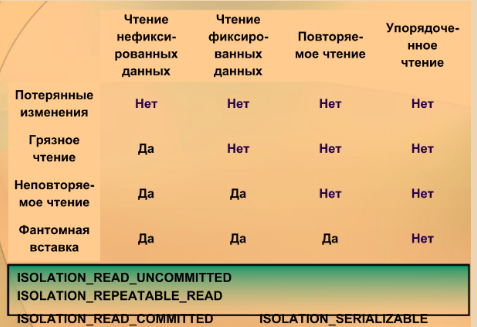

## Kiểm Thử Các Phương Thức Giao Dịch

- Nếu một phương thức kiểm thử được chú thích với `@Test` và cũng được chú thích với `@Transactional`, thì phương thức kiểm thử sẽ được thực thi trong một giao dịch. Sau khi phương thức kiểm thử hoàn tất, giao dịch này sẽ tự động bị **rollback**.
    - Không cần phải dọn dẹp cơ sở dữ liệu sau khi kiểm thử!
- Chính sách rollback của kiểm thử có thể được thay đổi bằng cách sử dụng chú thích `@Rollback` và thiết lập giá trị là `false`.
- Chú thích `@Sql` có thể được sử dụng để chỉ định các script SQL cần thực thi trên cơ sở dữ liệu trong suốt quá trình kiểm thử tích hợp.
- Chú thích `@SqlGroup` có thể được sử dụng trên các lớp và phương thức để nhóm các chú thích `@Sql` lại với nhau.
- Chú thích `@SqlConfig` được sử dụng để chỉ định cấu hình của các script SQL.

```java
@Test
@Sql(statements = {"drop table NEW_P_USER if exists;"})
 public void testCreateTable(){
	 int result = userRepo.createTable("new_p_user");
	 assertEquals(0, result);
 }
```

```java
@Test
@SqlGroup({
		@Sql(
				value = "classpath:db/extra-data.sql",
				config = @SqlConfig(encoding = "utf-8", separator = ";", commentPrefix = "--")
		),
		@Sql(
				scripts = "classpath:db/delete-test-data.sql",
				config = @SqlConfig(transactionMode = SqlConfig.TransactionMode.ISOLATED),
				executionPhase = Sql.ExecutionPhase.AFTER_TEST_METHOD
		)
})
public void testCount() {
	int count = userService.countUsers();
	assertEquals(8, count);
}   
```

### @Sql

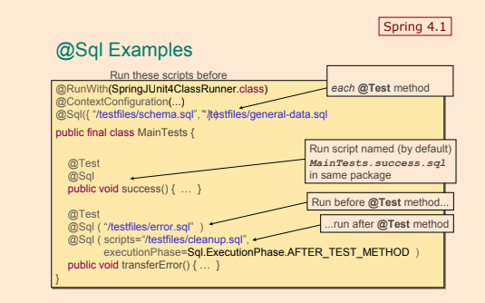

### @Commit

- Framework `TestContext` có thể được chỉ định để khiến giao dịch cam kết thay vì rollback thông qua chú thích `@Commit`.

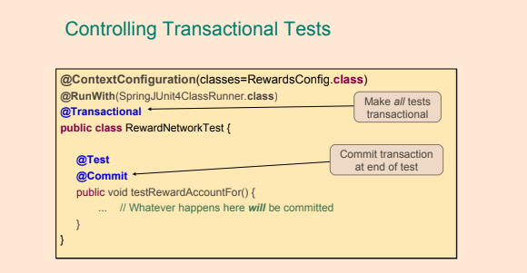

### @BeforeTransaction

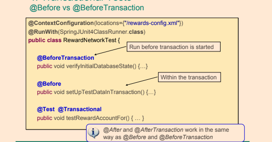

## Spring JDBC

- **`JdbcTemplate` của Spring**:
    - Giúp đơn giản hóa việc sử dụng JDBC API.
        - Loại bỏ mã lặp lại và phức tạp.
        - Giảm thiểu các lỗi thường gặp.
        - Quản lý `SQLExceptions` một cách hiệu quả.
    - Không làm mất đi khả năng thao tác với JDBC.
        - Cung cấp quyền truy cập đầy đủ vào các cấu trúc JDBC chuẩn.

- **Sau khi được cấu hình, các instance của `JdbcTemplate` là thread-safe**.
    - Có thể tiêm một instance đã được cấu hình của `JdbcTemplate` vào nhiều DAOs mà không gặp vấn đề về thread-safety.

- `JdbcTemplate` có một thuộc tính có kiểu là `DataSource`.

- `JdbcTemplate` là một lớp của Spring giúp đơn giản hóa việc sử dụng JDBC bằng cách thực hiện các quy trình truy vấn, cập nhật, và thực thi các câu lệnh SQL.
    - **Các instance của `JdbcTemplate` là thread-safe sau khi đã được tạo và cấu hình**.
    - `JdbcTemplate` tự động lấy và giải phóng kết nối cơ sở dữ liệu cho mỗi phương thức được gọi.

### Các phương thức của `JdbcTemplate`:

- **batchUpdate**
- **execute**
- **query** - dùng cho các câu lệnh `insert`, `update`, `delete`
- **queryForList**
- **queryForMap**
- **queryForObject**
- **queryForRowSet**
- **update**

### `SimpleJdbcCall`
- Lớp này có thể được sử dụng để gọi các **Stored Procedures** trong Spring.

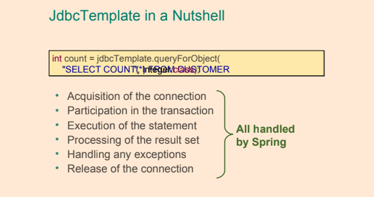

#### Cấu hình trong spring-context.xml

```xml
	<bean id="dataSource" class="org.springframework.jdbc.datasource.DriverManagerDataSource"
		  p:driverClassName="${driverClassName}"
		  p:url="${url}"
		  p:username="${username}"
		  p:password="${password}"
	/>

	<bean id="jdbcTemplate" class="org.springframework.jdbc.core.JdbcTemplate" p:dataSource-ref="dataSource"/>
```

#### Chèn Dữ Liệu

```java
jdbcTemplate.update("insert INTO RIDE(NAME, DURATION) values (?, ?)", ride.getName(), ride.getDuration());
```

#### Truy Vấn

```java
jdbcTemplate.query("SELECT * FROM MY_TABLE", new RowMapper());
```

#### Cập Nhật

```java
jdbcTemplate.update("UPDATE MY_TABLE set NAME = ?, DURATION = ? where id = ?",
			obj.getName(), obj.getDuration(), obj.getId());
```

#### Xóa

```java
jdbcTemplate.update("delete from MY_TABLE where id = ?", id);
```

#### Thực Thi

```java
this.jdbcTemplate.execute("create table mytable (id integer, name varchar(100))");
```

### Các Interface Callback

- **RowMapper**: Thích hợp khi mỗi dòng của `ResultSet` được ánh xạ thành một đối tượng domain.
- **RowCallbackHandler**: Thích hợp khi không cần trả về giá trị từ phương thức callback cho mỗi dòng, đặc biệt là khi thực hiện các truy vấn lớn.
- **ResultSetExtractor**: Thích hợp khi cần xử lý toàn bộ `ResultSet` cùng một lúc.

#### `RowMapper`

- Interface `RowMapper` cung cấp cách ánh xạ **mỗi dòng** của `ResultSet` thành một đối tượng.

```java
public interface RowMapper<T> {
	T mapRow(ResultSet rs, int rowNum) throws SQLException;
}
```

Ví dụ ánh xạ một đối tượng `Actor`:

```java
Actor actor = this.jdbcTemplate.queryForObject(
      "select first_name, last_name from t_actor where id = ?",
      new Object[]{1212L},
      new RowMapper<Actor>() {
          public Actor mapRow(ResultSet rs, int rowNum) throws SQLException {
              Actor actor = new Actor();
              actor.setFirstName(rs.getString("first_name"));
              actor.setLastName(rs.getString("last_name"));
              return actor;
          }
      });
```  

#### `RowCallbackHandler`

- Dùng để xử lý từng dòng của `ResultSet`.
- Khi không cần giá trị trả về từ phương thức callback cho mỗi dòng (ví dụ như khi xử lý các truy vấn lớn hoặc streaming dữ liệu).

```java
public interface RowCallbackHandler {
	void processRow(ResultSet rs) throws SQLException;
}
```

#### `ResultSetExtractor`

- Interface `ResultSetExtractor` dùng để xử lý toàn bộ `ResultSet` một lần.
- Thích hợp khi nhiều dòng dữ liệu cần được ánh xạ thành một đối tượng Java.

```java
public interface ResultSetExtractor<T> {
	T extractData(ResultSet rs) throws SQLException, DataAccessException;
}
```  

#### Querying for Generic Maps

- Truy vấn dữ liệu dưới dạng các map có thể chứa key-value pairs thay vì ánh xạ trực tiếp sang các đối tượng domain.

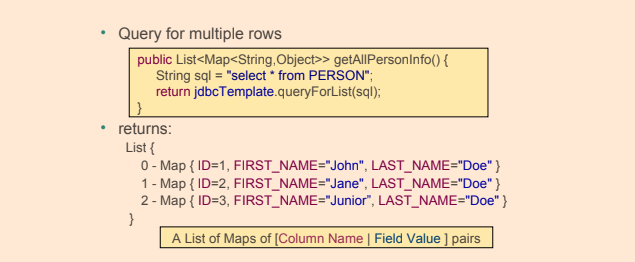

## Cơ sở dữ liệu trong bộ nhớ

```java
@Bean
public DataSource dataSource() {
    EmbeddedDatabaseBuilder builder = new EmbeddedDatabaseBuilder();
    builder.setName("inmemorydb")  // Đặt tên cho cơ sở dữ liệu trong bộ nhớ
           .setType(EmbeddedDatabaseType.HSQL)  // Chỉ định loại cơ sở dữ liệu (HSQL ở đây)
           .addScript("classpath:/inmemorydb/schema.db")  // Chạy script khởi tạo schema
           .addScript("classpath:/inmemorydb/data.db");  // Chạy script khởi tạo dữ liệu
    
    return builder.build();  // Xây dựng đối tượng DataSource
}
```

Cách cấu hình tương tự trong XML:

```xml
<jdbc:embedded-database id="dataSource" type="HSQL"> 
    <jdbc:script location="classpath:schema.sql" />  <!-- Chạy script khởi tạo schema -->
    <jdbc:script location="classpath:data.sql" />  <!-- Chạy script khởi tạo dữ liệu -->
</jdbc:embedded-database>
```

Khởi tạo cơ sở dữ liệu:

```xml
<jdbc:initialize-database data-source="dataSource"> 
    <jdbc:script location="classpath:schema.sql" />  <!-- Chạy script khởi tạo schema -->
    <jdbc:script location="classpath:data.sql" />  <!-- Chạy script khởi tạo dữ liệu -->
</jdbc:initialize-database>
```

- `EmbeddedDatabaseBuilder` tự động chạy các script **data.sql** và **schema.sql** từ thư mục `resources`.

## Spring và Hibernate

- `org.springframework.orm.hibernate5.LocalSessionFactoryBuilder`
- `org.hibernate.SessionFactory`
- `org.hibernate.Session`
- `org.springframework.orm.hibernate4.HibernateTransactionManager`

## Hibernate

- `hibernate.dialect` - Giá trị của tham số này là một lớp dialect tương ứng với cơ sở dữ liệu được sử dụng trong ứng dụng.
- `hibernate.hbm2ddl.auto` - Giá trị của tham số này xác định Hibernate sẽ làm gì khi ứng dụng khởi động.
- `hibernate.format_sql` - Các câu lệnh SQL được sinh ra sẽ được in ra console theo cách dễ đọc.
- `hibernate.show_sql` - Nếu giá trị là true, tất cả các câu lệnh SQL được sinh ra sẽ được in ra console.
- `hibernate.use_sql_comments` - Nếu giá trị là true, Hibernate sẽ thêm một comment vào câu lệnh SQL để giải thích về mục đích của câu lệnh đó.

## Cấu hình Spring + Hibernate bằng Java

- Inject các tham số cơ sở dữ liệu và sử dụng chúng khi tạo các bean

```java
@Value("${driverClassName}")
private String driverClassName;
@Value("${url}")
private String url;
@Value("${login}")
private String username;
@Value("${password}")
private String password;
```

- Tạo `dataSource`

```java
@Bean
public DataSource dataSource() {
    final DriverManagerDataSource dataSource = new DriverManagerDataSource();
    dataSource.setDriverClassName(driverClassName);
    dataSource.setUrl(url);
    dataSource.setUsername(username);
    dataSource.setPassword(password);
    return dataSource;
}
```

- Tạo `sessionFactory`

```java
@Bean
public Properties hibernateProperties() {
    final Properties hibernateProp = new Properties();
    hibernateProp.put("hibernate.dialect", "org.hibernate.dialect.H2Dialect");
    hibernateProp.put("hibernate.hbm2ddl.auto", "create-drop");
    hibernateProp.put("hibernate.format_sql", true);
    hibernateProp.put("hibernate.use_sql_comments", true);
    hibernateProp.put("hibernate.show_sql", true);
    return hibernateProp;
}

@Bean
public SessionFactory sessionFactory() {
    return new LocalSessionFactoryBuilder(dataSource())
            .scanPackages("com.ps.ents")
            .addProperties(hibernateProperties())
            .buildSessionFactory();
}
```

- Tạo `transactionManager`

```java
@Bean
public PlatformTransactionManager transactionManager() {
    return new HibernateTransactionManager(sessionFactory());
}
```

- Tạo `@Repository` bean

```java
@Repository
@Transactional
public class HibernateUserRepo implements UserRepo {
	
}
```

- Inject `sessionFactory` vào các `@Repository` bean và sử dụng session để xử lý với cơ sở dữ liệu

```java
@Repository
@Transactional
public class HibernateUserRepo implements UserRepo {

    @Autowired
    private SessionFactory sessionFactory;
	
    public Session session() {
        return sessionFactory.getCurrentSession();
    }
}
```

## Cấu hình Spring + Hibernate bằng XML

- Tạo `dataSource`

```xml
<bean id="dataSource" class="org.springframework.jdbc.datasource.DriverManagerDataSource">
	<property name="driverClassName" value="${driverClassName}" />
	<property name="url" value="${url}" />
	<property name="username" value="${login}" />
	<property name="password" value="${password}" />
</bean>
```

- Tạo `sessionFactory`

```xml
<bean id="sessionFactory" class="org.springframework.orm.hibernate5.LocalSessionFactoryBean">
	<property name="dataSource" ref="dataSource" />
	<property name="packagesToScan" value="com.ps" />
	<property name="hibernateProperties">
		<props>
			<prop key="hibernate.hbm2ddl.auto">create-drop</prop>
			<prop key="hibernate.dialect">org.hibernate.dialect.H2Dialect</prop>
		</props>
	</property>
</bean>
```

- Tạo `transactionManager`

```xml
<bean id="transactionManager" class="org.springframework.orm.hibernate5.HibernateTransactionManager">
	<property name="sessionFactory" ref="sessionFactory" />
</bean>
```

- Tạo `@Repository` bean

```java
@Repository
@Transactional
public class HibernateUserRepo implements UserRepo {
	
}
```

- Inject `sessionFactory` vào các `@Repository` bean và sử dụng session để thao tác với cơ sở dữ liệu

```java
@Repository
@Transactional
public class HibernateUserRepo implements UserRepo {

	@Autowired
	private SessionFactory sessionFactory;
	
	public Session session() {
		return sessionFactory.getCurrentSession();
	}
}
```

### @Repository

- Công việc của `@Repository` là bắt các ngoại lệ liên quan đến lưu trữ và ném lại chúng dưới dạng một trong các ngoại lệ không kiểm tra của Spring.
- Spring có cơ chế dịch ngoại lệ tích hợp sẵn, vì vậy tất cả các ngoại lệ được ném ra bởi các nhà cung cấp lưu trữ JPA đều sẽ được chuyển đổi thành `DataAccessException` của Spring - cho tất cả các bean được đánh dấu với `@Repository`:
    - `NonTransientDataAccessException` – là những ngoại lệ mà nếu thử lại cùng một thao tác sẽ thất bại trừ khi nguyên nhân của ngoại lệ được sửa chữa. Ví dụ, nếu bạn truyền một ID không tồn tại, thao tác sẽ thất bại trừ khi ID đó tồn tại trong cơ sở dữ liệu.
    - `RecoverableDataAccessException` – là những ngoại lệ có thể khôi phục được sau một số bước khôi phục. Thêm chi tiết có trong tài liệu API.
    - `ScriptException` – các ngoại lệ liên quan đến SQL, ví dụ như khi cố gắng xử lý một script không hợp lệ.
    - `TransientDataAccessException` – là những ngoại lệ khi có thể khôi phục mà không cần bước khôi phục cụ thể, ví dụ khi có lỗi timeout với cơ sở dữ liệu và bạn thử lại sau một vài giây.
- `DataAccessException` có rất nhiều lớp con mà bạn có thể khám phá, cấu trúc của nó rất rộng.
- Logic được thực hiện bởi `org.springframework.dao.annotation.PersistenceExceptionTranslationPostProcessor`
    - Đây là một bean post-processor tự động áp dụng dịch ngoại lệ lưu trữ cho bất kỳ bean nào được đánh dấu bằng annotation `@Repository` của Spring.

## Spring + JPA Cấu hình Java

- Các bước cần thiết nếu bạn muốn làm việc với JPA trong ứng dụng Spring:
    - **Khai báo các phụ thuộc cần thiết.**  
      Trong một ứng dụng Maven, điều này được thực hiện bằng cách tạo các phụ thuộc trong tệp `pom.xml`. Các phụ thuộc này thường bao gồm phụ thuộc vào framework ORM, phụ thuộc vào driver cơ sở dữ liệu và phụ thuộc vào quản lý giao dịch.
    - **Triển khai các lớp entity với metadata ánh xạ dưới dạng annotation.**  
      Ít nhất, các lớp entity cần được đánh dấu với annotation `@Entity` ở cấp độ lớp và annotation `@Id` đánh dấu trường hoặc thuộc tính sẽ là khóa chính của entity.
        - Annotation `@Entity` được sử dụng để đánh dấu các lớp, giúp biến các instance của lớp đó thành các thực thể lưu trữ.
        - Annotation `@Entity` chỉ có thể được áp dụng ở cấp độ lớp.
    - **Định nghĩa một `EntityManagerFactory` bean.**  
      Hỗ trợ JPA trong Spring framework cung cấp ba lựa chọn khi tạo một `EntityManagerFactoryBean`:
        - `LocalEntityManagerFactoryBean` <br/>
          Sử dụng lựa chọn này, là lựa chọn đơn giản nhất, trong các ứng dụng chỉ sử dụng JPA cho việc lưu trữ và trong các bài kiểm tra tích hợp.
        - Lấy `EntityManagerFactory` qua JNDI <br/>
          Sử dụng lựa chọn này nếu ứng dụng được chạy trong một server JavaEE.
        - `LocalContainerEntityManagerFactoryBean` <br/>
          Cung cấp cho ứng dụng toàn bộ khả năng của JPA.
    - **Định nghĩa một `DataSource` bean.**
    - **Định nghĩa một `TransactionManager` bean.**  
      Thường sử dụng lớp `JpaTransactionManager` từ Spring Framework.
        - `JpaTransactionManager` là một triển khai của `PlatformTransactionManager` cho một `EntityManagerFactory` JPA duy nhất.
    - **Triển khai các repositories.**

- `@PersistenceContext` – annotation này được áp dụng cho một biến instance có kiểu `EntityManager` hoặc một phương thức setter, nhận một tham số kiểu `EntityManager`, vào đó một entity manager sẽ được tiêm vào.
    - Ngữ cảnh lưu trữ (persistence context) là một tập hợp các đối tượng được quản lý, tức là các entities.
    - Tương đương của JPA với `@Autowired`.
- `EntityManager` cung cấp một API để quản lý ngữ cảnh lưu trữ và tương tác với các thực thể trong ngữ cảnh lưu trữ.
- `EntityManager` quản lý ngữ cảnh lưu trữ.
- `EntityManager` chứa các triển khai của các thao tác để quản lý và tương tác với ngữ cảnh lưu trữ.

```java
@PersistenceContext
private EntityManager entityManager;
```

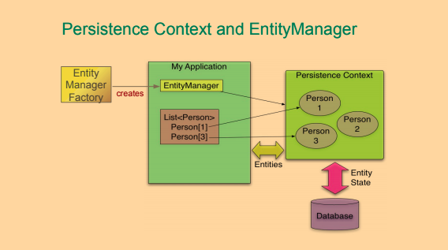

- `PlatformTransactionManager`

```java
@Bean
public PlatformTransactionManager txManager(){
    return new DataSourceTransactionManager(dataSource());
}

@Bean
public DataSource dataSource() {
	final DriverManagerDataSource dataSource = new DriverManagerDataSource();
	dataSource.setDriverClassName(driverClassName);
	dataSource.setUrl(url);
	dataSource.setUsername(username);
	dataSource.setPassword(password);

	return dataSource;
}
```

---

- Tạo `HibernateProperties`

```java
@Bean
public Properties hibernateProperties() {
	final Properties hibernateProp = new Properties();
	hibernateProp.put("hibernate.dialect", "org.hibernate.dialect.H2Dialect");
	hibernateProp.put("hibernate.hbm2ddl.auto", "create-drop");
	hibernateProp.put("hibernate.format_sql", true);
	hibernateProp.put("hibernate.use_sql_comments", true);
	hibernateProp.put("hibernate.show_sql", true);
	return hibernateProp;
}
```

- Tạo `EntityManagerFactory` - Một entity manager factory được sử dụng để tương tác với một đơn vị lưu trữ. `@PersistenceUnit`

```java
@Bean
public EntityManagerFactory entityManagerFactory() {
	final LocalContainerEntityManagerFactoryBean factoryBean = new LocalContainerEntityManagerFactoryBean();
	factoryBean.setPackagesToScan("com.ps.ents");
	factoryBean.setDataSource(dataSource());
	factoryBean.setJpaVendorAdapter(new HibernateJpaVendorAdapter());
	factoryBean.setJpaProperties(hibernateProperties());
	factoryBean.afterPropertiesSet();
	return factoryBean.getNativeEntityManagerFactory();
}
```

- Tạo `TransactionManager`

```java
@Bean
public PlatformTransactionManager transactionManager() {
	return new JpaTransactionManager(entityManagerFactory());
}
```

- Tạo `@Repository` Bean

```java
@Repository("userJpaRepo")
public class JpaUserRepo implements UserRepo {
	
}
```

- Inject `EntityManager` vào các `@Repository` beans và sử dụng session để thao tác với cơ sở dữ liệu

```java
@PersistenceContext
private EntityManager entityManager;
```

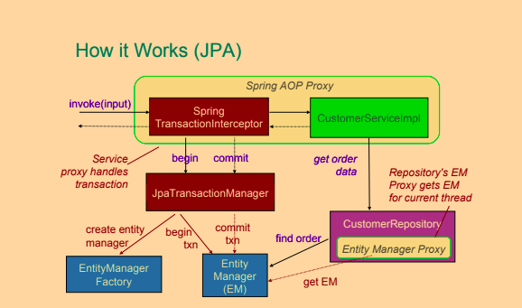

## Spring + JPA Cấu hình XML

- Thêm quản lý giao dịch

```xml
<tx:annotation-driven />

<bean id="transactionManager" class="org.springframework.orm.jpa.JpaTransactionManager">
		<property name="entityManagerFactory" ref="entityManagerFactory" />
</bean>
```

- Thêm `DataSource` bean

```xml
<bean id="dataSource" class="org.springframework.jdbc.datasource.DriverManagerDataSource">
	<property name="driverClassName" value="${driverClassName}" />
	<property name="url" value="${url}" />
	<property name="username" value="${username}" />
	<property name="password" value="${password}" />
</bean>
```

- Thêm `EntityManagerFactory` bean

```xml
<bean id="entityManagerFactory"
	  class="org.springframework.orm.jpa.LocalContainerEntityManagerFactoryBean">
	<property name="dataSource" ref="dataSource" />
	<property name="packagesToScan" value="com.ps" />
	<property name="jpaVendorAdapter">
		<bean class="org.springframework.orm.jpa.vendor.HibernateJpaVendorAdapter" />
	</property>
	<property name="jpaProperties">
		<props>
			<prop key="hibernate.hbm2ddl.auto">create-drop</prop>
			<prop key="hibernate.dialect">org.hibernate.dialect.MySQL5Dialect</prop>
		</props>
	</property>
</bean>
```

- Tạo `@Repository` Bean

```java
@Repository("userJpaRepo")
public class JpaUserRepo implements UserRepo {
	
}
```

- Tiêm `EntityManager` vào các `@Repository` beans và sử dụng session để thao tác với cơ sở dữ liệu

```java
@PersistenceContext
private EntityManager entityManager;
```

## Spring Data JPA

- **Đơn giản hóa việc truy cập dữ liệu** bằng cách giảm thiểu mã lặp lại.
- **Giao diện trung tâm** của Spring Data là `Repository<T, ID extends Serializable>`.
- **Tạo lớp domain object** mà sẽ được ánh xạ với đối tượng trong cơ sở dữ liệu. Lớp này phải có trường `id` và được đánh dấu bằng chú thích đặc biệt `@Id` từ gói `org.springframework.data.annotation`.
- **Tạo giao diện Repo** mới kế thừa giao diện chuyên biệt của Spring Data MongoDB `MongoRepository<T, ID extends Serializable>`.
- **Tạo lớp cấu hình** và chú thích nó bằng `@EnableMongoRepositories` để bật chế độ tạo các thể hiện repository cho MongoDB.

### Spring Data Repositories

- Spring tìm tất cả các giao diện kế thừa `Repository<DomainObjectType, DomainObjectIdType>`.
- `Repository` là giao diện đánh dấu và không có phương thức riêng.
- Có thể chú thích các phương thức trong giao diện với `@Query("Select p from person p where ...")`.
- Có thể kế thừa `CrudRepository` thay vì `Repository` để bổ sung các phương thức CRUD.
- Các tên phương thức được tạo tự động dựa trên quy ước đặt tên:
    - `findBy + Field (+ Operation)`, ví dụ: `findByFirstName(String name)`, `findByDateOfBirthGt(Date date)`.
    - Các phép toán: `Gt`, `Lt`, `Ne`, `Like`, `Between`, ...
- Có thể kế thừa `PagingAndSortingRepository` để thêm tính năng phân trang và sắp xếp.
- Các Spring Data sub-projects có các biến thể riêng của `Repository`:
    - `JpaRepository` cho JPA.
- Các repository có thể được tiêm qua loại giao diện của chúng.
- **Repository là giao diện (không phải lớp!)**.
- Sử dụng **JDK proxy**:
    - Các repository được định nghĩa dưới dạng giao diện để Spring Data có thể sử dụng cơ chế **JDK dynamic proxy** để tạo các đối tượng proxy mà sẽ chặn các lời gọi đến repository.
    - Điều này cũng cho phép cung cấp một lớp cài đặt repository cơ sở tùy chỉnh mà sẽ là lớp cơ sở (tùy chỉnh) cho tất cả các repository trong ứng dụng.

- **Instant Repository**:
    - Một `instant repository` (còn gọi là Spring Data repository) là repository không cần cài đặt và hỗ trợ các thao tác cơ bản **CRUD** (tạo, đọc, cập nhật và xóa).
    - Repository này được khai báo dưới dạng giao diện và thường kế thừa giao diện `Repository`.

```java
public interface PersonRepository extends Repository<Person, Long> {
    
}
```

```java
public interface PersonRepository extends JpaRepository<Person, SocialSecurityNumber> {
	
}
```

```java
@Service    
public class PersonService {

    @Autowired
    private PersonRepository personRepository;
           
}
```

- Các vị trí mà Spring nên tìm kiếm giao diện `Repository` cần được xác định rõ ràng:
    - Spring quét các giao diện `Repository`, triển khai chúng và tạo thành Spring bean.

```java
@Configuration 
@EnableJpaRepositories(basePackages="com.example.**.repository") 
public class JpaConfig {...}

@Configuration 
@EnableGemfireRepositories(basePackages="com.example.**.repository")
public class GemfireConfig {...}
  
@Configuration 
@EnableMongoRepositories(basePackages="com.example.**.repository") 
public class MongoDbConfig {...}
```

### Quy ước đặt tên cho các phương thức tìm kiếm

- Nếu tuân theo quy ước đặt tên dưới đây, Spring Data sẽ nhận diện các phương thức tìm kiếm này và cung cấp một cài đặt cho chúng.

```java
find(First[count])By[property expression][comparison operator][ordering operator]
```

- **Tên phương thức tìm kiếm**:
    - `find`, `findBy`, `getBy`, `readBy`
- Tùy chọn, có thể thêm `First` sau `find` để chỉ lấy đối tượng đầu tiên tìm thấy.
    - Ví dụ: `findFirst10`.
- Câu lệnh thuộc tính (property expression) tùy chọn chọn thuộc tính của một thực thể để tìm kiếm thực thể/các thực thể cần lấy.
    - `IgnoreCase`
    - Có thể nối nhiều thuộc tính bằng `AND` hoặc `OR`.
- Toán tử so sánh (comparison operator) tùy chọn cho phép tạo các phương thức tìm kiếm chọn một phạm vi thực thể.
    - `LessThan`, `GreaterThan`, `Between`, `Like`
- Toán tử sắp xếp (ordering operator) cho phép sắp xếp danh sách nhiều thực thể theo một thuộc tính của thực thể.
    - `OrderBy`, `Asc`, `Desc`
    - Ví dụ: `findPersonByLastnameOrderBySocialsecuritynumberDesc` - tìm kiếm những người có họ được cung cấp và sắp xếp chúng theo số an sinh xã hội giảm dần.

## Cấu hình Spring Data

### Cấu hình Java

- Để bật các repository JPA trong cấu hình Java, bạn sử dụng chú thích `@EnableJpaRepositories` với thuộc tính `basePackages` chỉ định gói chứa các repository.
    ```java
    @EnableJpaRepositories(basePackages = "com.example.**.repository")
    ```
    - Chú thích này sẽ kích hoạt việc phát hiện và tạo các repository JPA từ các giao diện đã được định nghĩa.

### Cấu hình XML

- Đối với cấu hình XML, sử dụng thẻ `<jpa:repositories>` để bật các repository JPA.
    ```xml
    <jpa:repositories base-package="com.example.**.repository"/>
    ```
    - Thẻ này xác định gói chứa các repository và giúp Spring Data phát hiện chúng.

### Hình ảnh minh họa

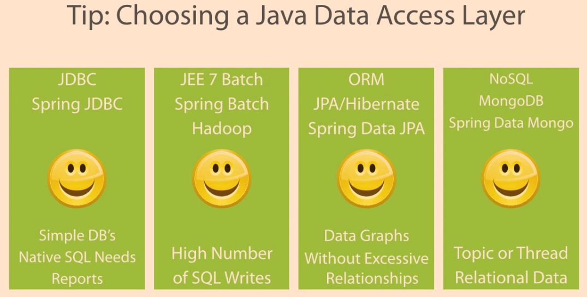

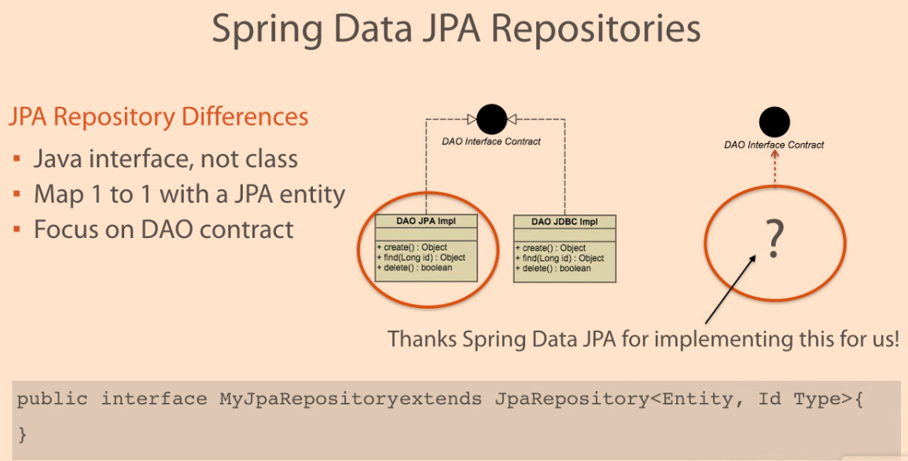

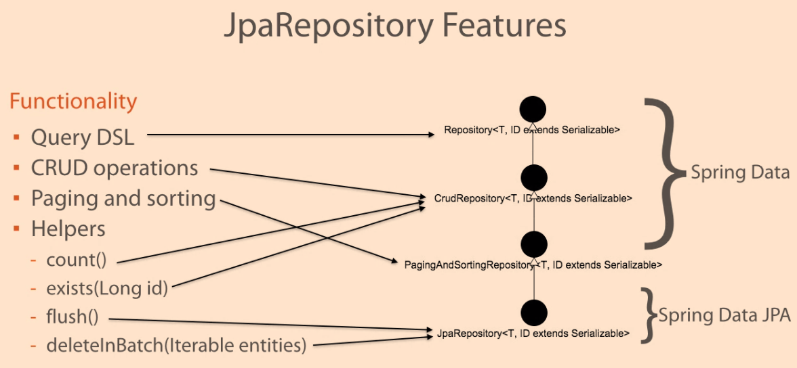

## Query DSL

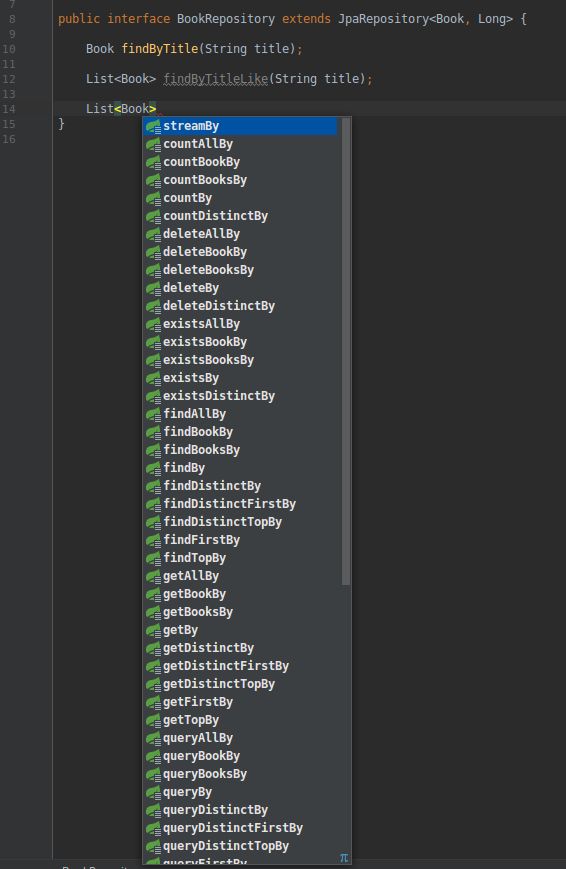

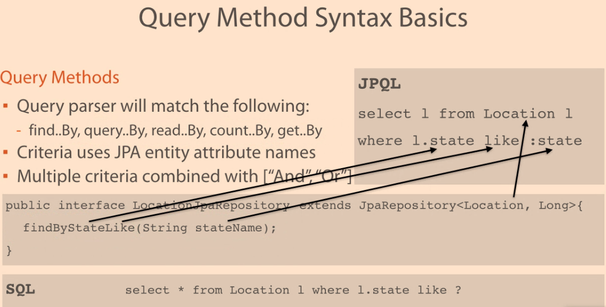

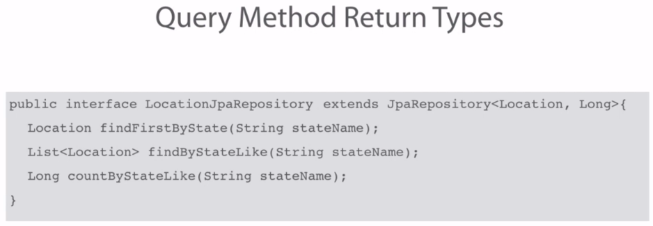

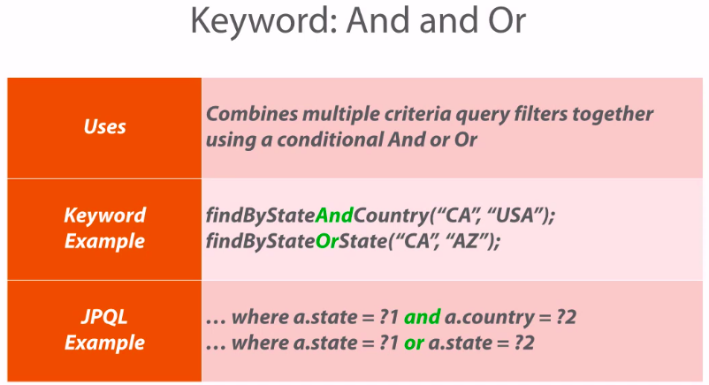

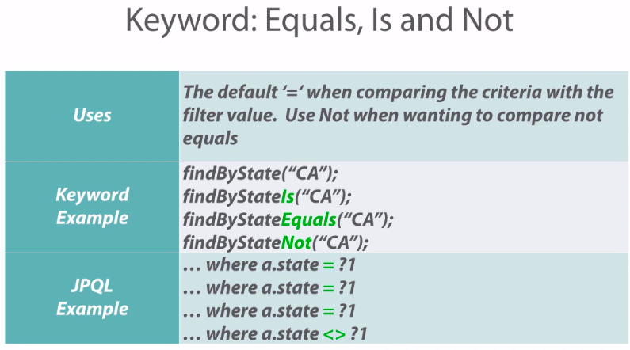

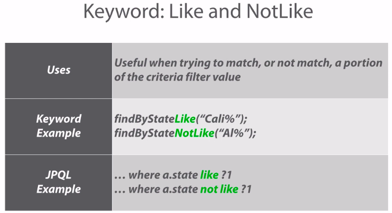

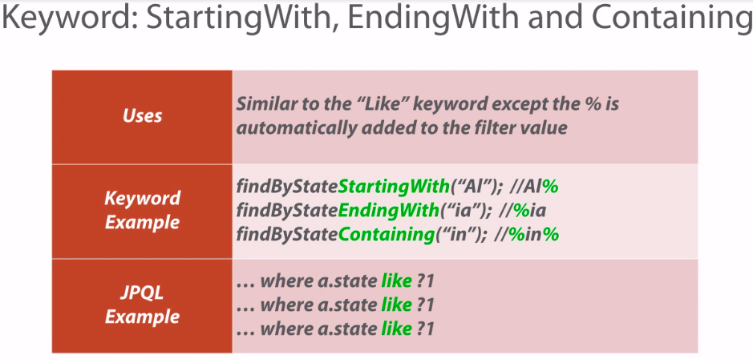

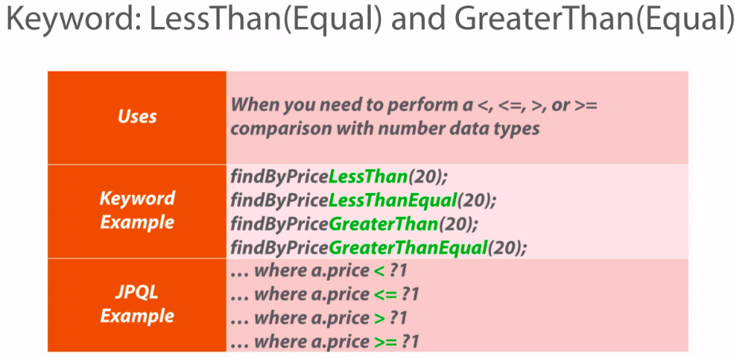

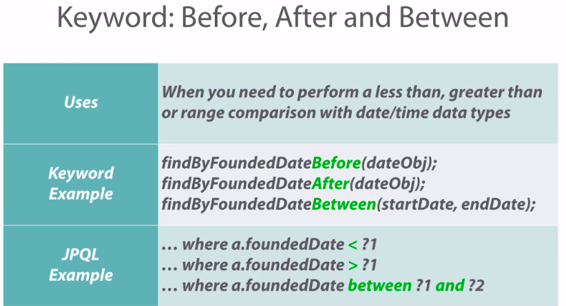

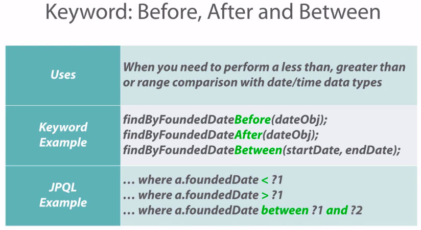

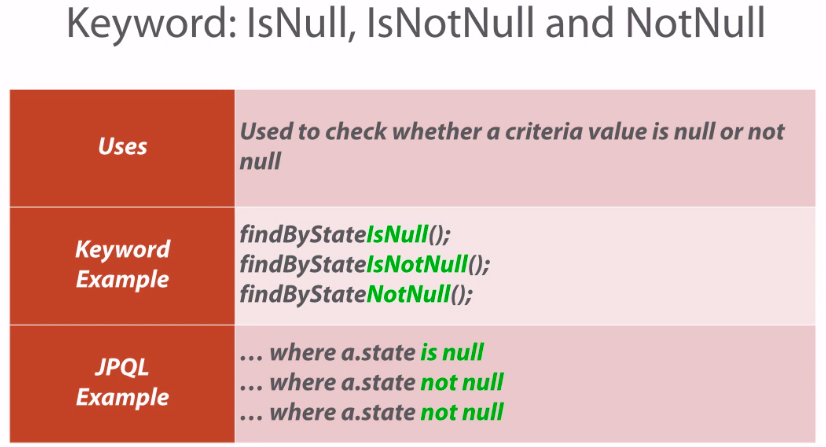

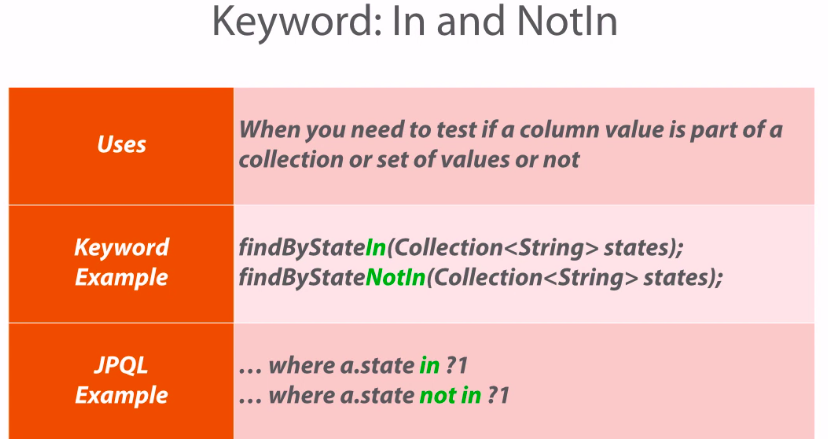

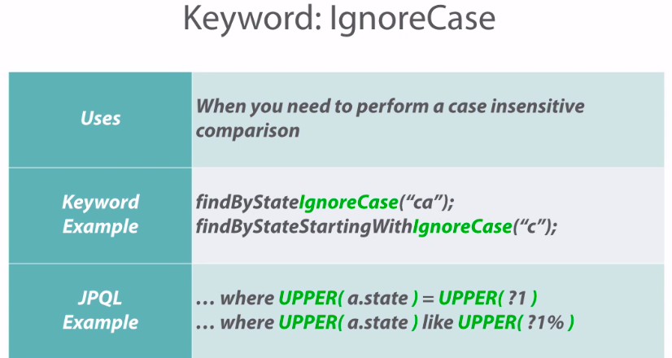

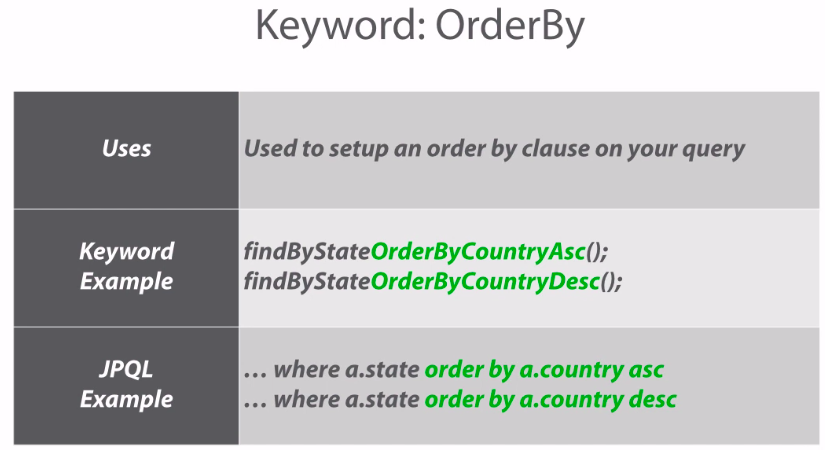

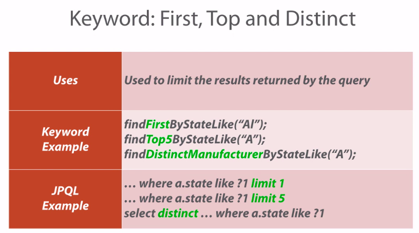

### Chú thích `@Query` trong Spring Data

- Chú thích `@Query` cho phép bạn xác định các truy vấn JPQL hoặc native queries trực tiếp trong repository.
- Khi sử dụng `@Query`, các truy vấn này sẽ ưu tiên hơn các truy vấn được định nghĩa trong `@NamedQuery` hoặc trong file `orm.xml`.
- Bạn có thể thực thi các truy vấn native (truy vấn gốc của SQL) bằng cách thiết lập tham số **nativeQuery** là `true`.
    ```java
    @Query(value = "SELECT * FROM Book WHERE title LIKE ?1", nativeQuery = true)
    List<Book> findByTitle(String title);
    ```

- Tuy nhiên, **pagination** và **dynamic sorting** không được hỗ trợ khi sử dụng native queries.

### Named Query

- Named queries được định nghĩa trong file `orm.xml` hoặc trong lớp entity thông qua `@NamedQuery`.
- Named queries giúp tái sử dụng truy vấn trong toàn bộ ứng dụng và giảm thiểu việc lặp lại mã.

### Native Query

- Native queries là truy vấn SQL gốc được sử dụng khi bạn muốn thực thi câu lệnh SQL thuần túy mà không thông qua JPQL.
- Bạn có thể sử dụng `nativeQuery = true` trong `@Query` để thực thi một truy vấn SQL gốc.

### Precedence của Truy vấn

- Khi có sự xuất hiện của cả `@Query`, `@NamedQuery` và truy vấn trong `orm.xml`, Spring Data sẽ ưu tiên `@Query` trong repository.
  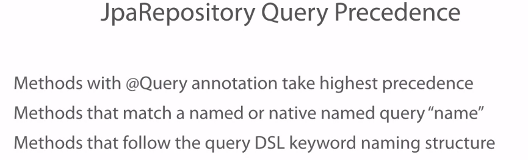

### Paging và Sorting

- Spring Data hỗ trợ phân trang và sắp xếp cho các truy vấn. Ví dụ sau đây sử dụng phương thức `queryByPriceRangeAndWoodTypePaging` để phân trang kết quả.
    ```java
    @Test
    public void testQueryByPriceRangeAndWoodTypePaging_SpringData() {
        final Pageable pageable = PageRequest.of(0, 2);

        Page<Model> page = modelDataJPARepository
                .queryByPriceRangeAndWoodTypePaging(
                        BigDecimal.valueOf(1000L), BigDecimal.valueOf(2000L), "%Maple%", pageable);
        
        Iterator<Model> iterator = page.iterator();
        while (iterator.hasNext()) {
            System.out.println(iterator.next());
        }

        // Next page
        page = modelDataJPARepository
                .queryByPriceRangeAndWoodTypePaging(
                        BigDecimal.valueOf(1000L), BigDecimal.valueOf(2000L), "%Maple%", page.nextPageable());
        iterator = page.iterator();
        while (iterator.hasNext()) {
            System.out.println(iterator.next());
        }
    }
    ```

### Custom Repositories

- Bạn có thể tạo các repository tùy chỉnh bằng cách định nghĩa giao diện mở rộng từ `JpaRepository` và thực hiện các truy vấn phức tạp trong đó.
  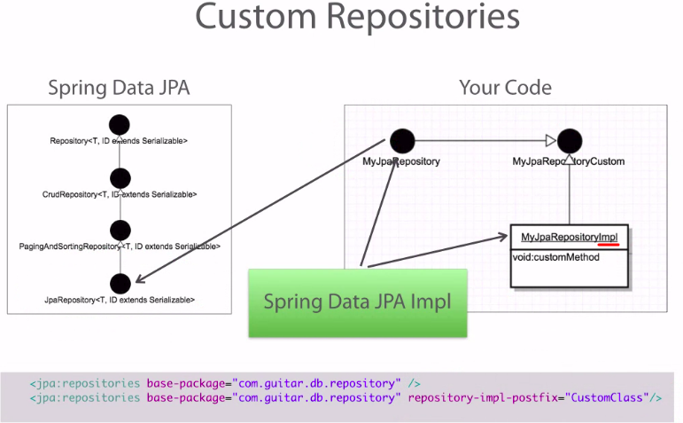

### Auditing

- Spring Data hỗ trợ auditing, giúp tự động cập nhật các trường như `createdDate`, `modifiedDate`, `createdBy`, và `modifiedBy` khi các đối tượng được lưu trữ hoặc cập nhật.
  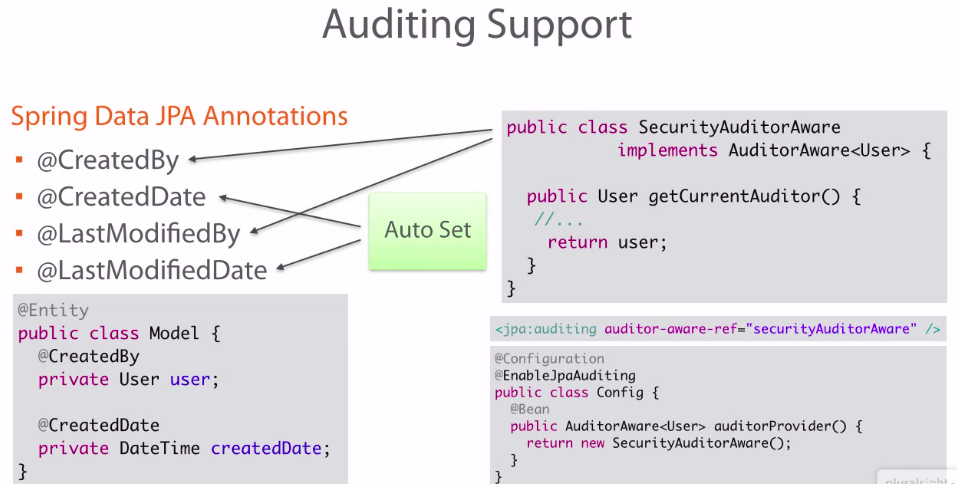

### Locking

- Spring Data hỗ trợ cơ chế khóa (locking) khi thực hiện các truy vấn, giúp ngăn chặn các vấn đề đồng bộ hóa khi nhiều transaction cố gắng cập nhật dữ liệu cùng lúc.
  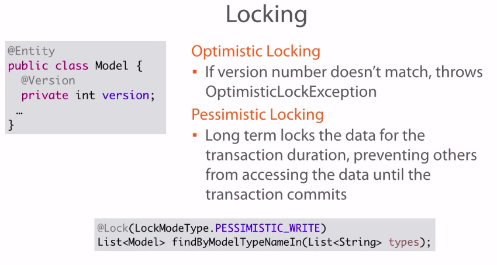

### Cập nhật Dữ liệu với `@Modifying` và `@Query`

- Để thực hiện các truy vấn cập nhật hoặc xóa, bạn sử dụng chú thích `@Modifying` kết hợp với `@Query`.
    ```java
    @Transactional
    @Modifying
    @Query("update Book b set b.pageCount = ?1 where b.title like ?2")
    int setPageCount(int pageCount, String title);
    ```

Các tính năng này giúp Spring Data trở thành một công cụ mạnh mẽ và dễ sử dụng để thao tác với dữ liệu trong các ứng dụng Spring.

## Query Annotation

- Queries annotated to the `@Query` will take precedence over queries defined using `@NamedQuery` or named queries declared in `orm.xml`.
- `@Query` annotation allows to execute native queries by setting the **nativeQuery** flag to true
- The execution of pagination or dynamic sorting for `native queries` is not supported.

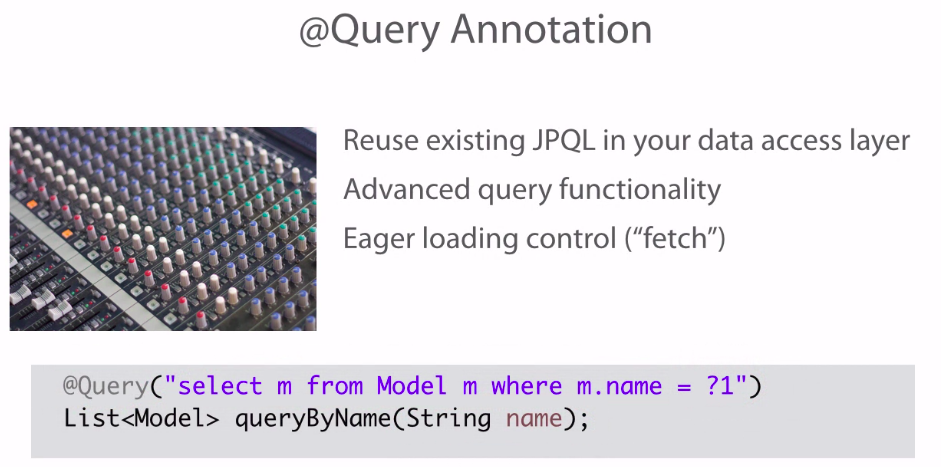

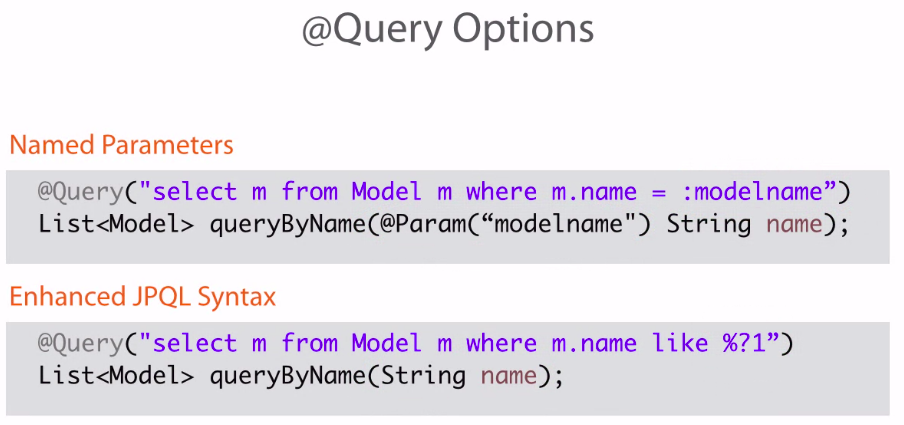

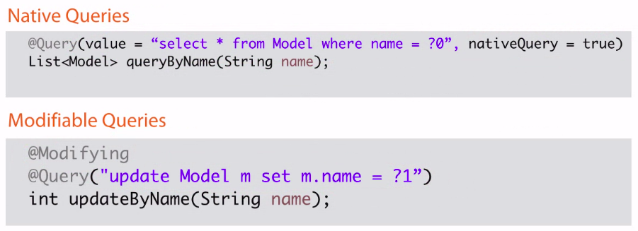

## Named Query

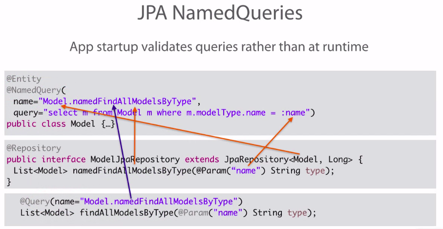

## Native Query

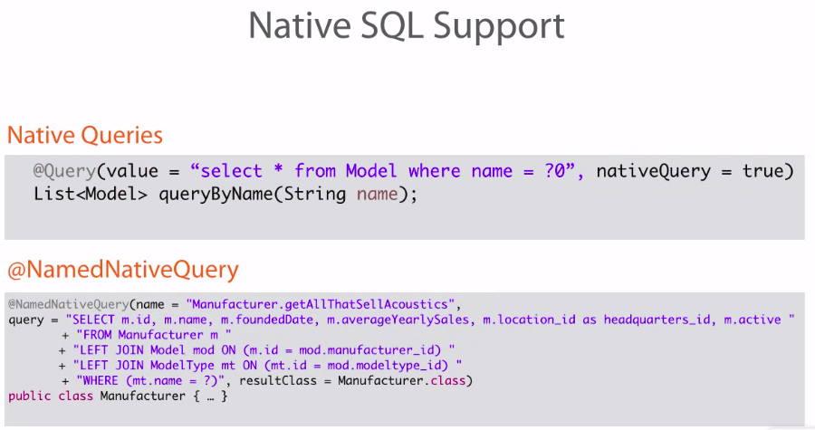

## Query Precedence


## Paging and Sorting

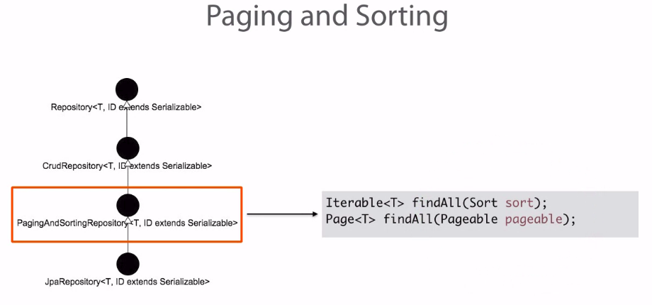

```java
@Test
public void testQueryByPriceRangeAndWoodTypePaging_SpringData() {
    final Pageable pageable = new PageRequest(0, 2);

    Page<Model> page = modelDataJPARepository
            .queryByPriceRangeAndWoodTypePaging(
                    BigDecimal.valueOf(1000L), BigDecimal.valueOf(2000L), "%Maple%", pageable);
    /* select name from Model m where m.price>=? and m.price<=? and (m.woodType like ?) limit ? */
    
    Iterator<Model> iterator = page.iterator();
    while (iterator.hasNext()){
        System.out.println(iterator.next());
    }
    // American Stratocaster
    // Les Paul

    page = modelDataJPARepository
            .queryByPriceRangeAndWoodTypePaging(
                    BigDecimal.valueOf(1000L), BigDecimal.valueOf(2000L), "%Maple%", page.nextPageable());

    /* select name from Model m where m.price>=? and m.price<=? and (m.woodType like ?) limit ? offset ?*/
    iterator = page.iterator();
    while (iterator.hasNext()){
        System.out.println(iterator.next());
    }
    // SG
}
```
## Custom Repositories


## Auditing


## Locking


## Spring data for updating data

```java
@Transactional
@Modifying
@Query("update Book b set b.pageCount = ?1 where b.title like ?2")
int setPageCount(int pageCount, String title);
```