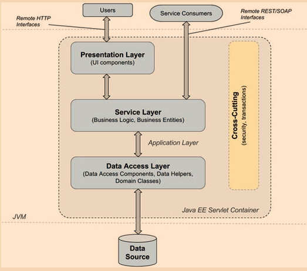
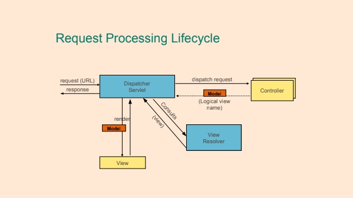
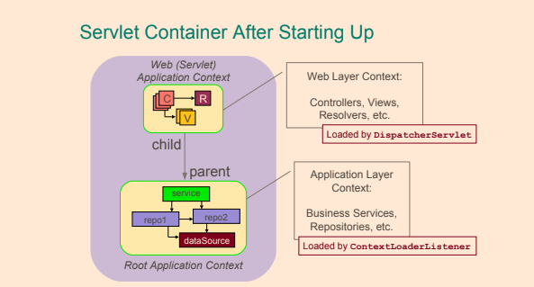
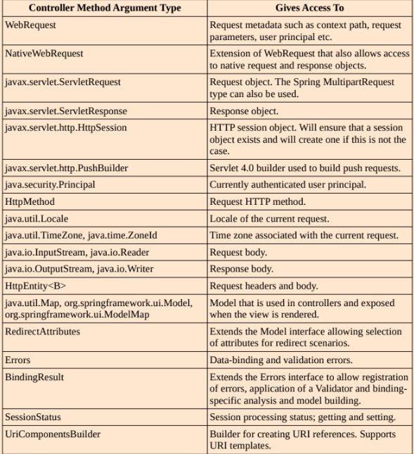
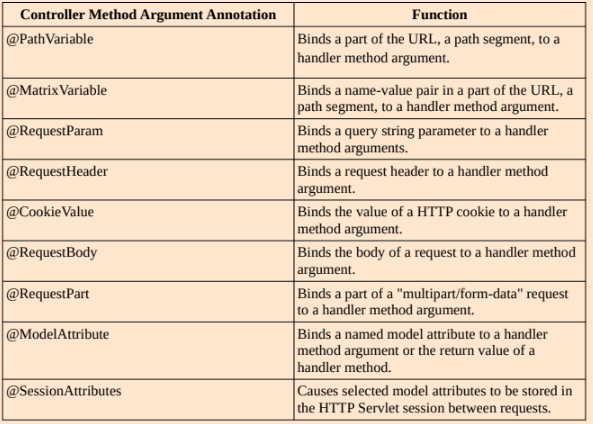
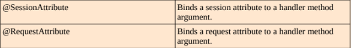
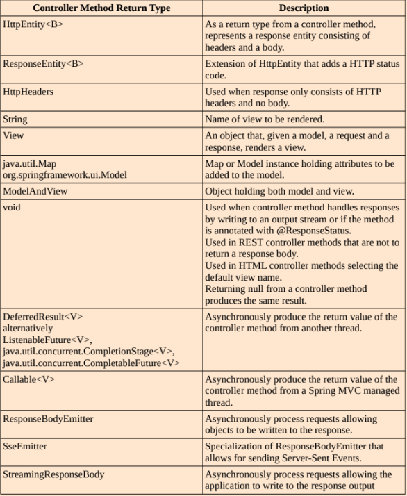
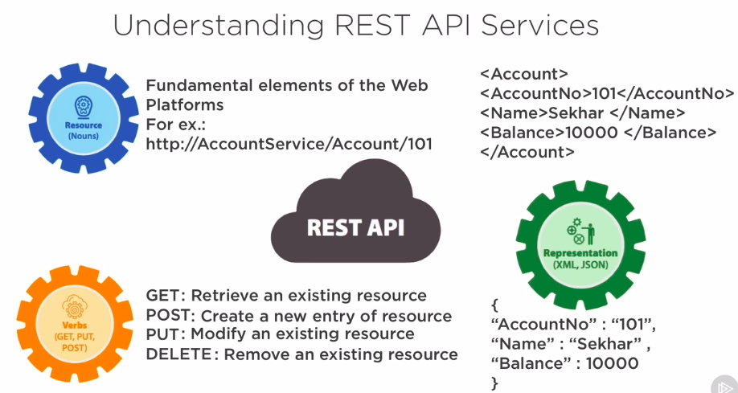

# Spring MVC

- A typical Java Web application architecture



- Request life cycle


### DispatcherServlet

- Tài liệu tham khảo của Spring nói rằng:
  **"Trong framework Web MVC, mỗi `DispatcherServlet` có một `WebApplicationContext` riêng, kế thừa tất cả các bean đã được định nghĩa trong `WebApplicationContext` gốc.  
  Những bean kế thừa này có thể bị ghi đè trong phạm vi servlet cụ thể, và bạn có thể định nghĩa các bean mới có phạm vi cụ thể cho một instance Servlet nhất định."**
- Tài liệu tham khảo của Spring cũng nói rằng:
  **"`WebApplicationContext` là một mở rộng của `ApplicationContext` thông thường, có thêm các tính năng cần thiết cho các ứng dụng web.
  Nó khác biệt so với `ApplicationContext` bình thường ở chỗ có khả năng giải quyết chủ đề và biết Servlet nào mà nó liên kết với (bằng cách có liên kết tới `ServletContext`)."**
- Thành phần trung tâm của Spring Web MVC là lớp `DispatcherServlet`, đây là điểm đầu vào cho mỗi ứng dụng Web Spring.
- `DispatcherServlet` chuyển đổi các yêu cầu HTTP thành các lệnh cho các thành phần controller và quản lý dữ liệu đã được render.
- Trong một ứng dụng Spring Web, tất cả các yêu cầu HTTP đều đến với `DispatcherServlet` trước tiên.
- `DispatcherServlet` phải được định nghĩa trong `web.xml` khi ứng dụng được cấu hình bằng cấu hình XML kiểu cũ.
- `DispatcherServlet` phải được định nghĩa trong `web.xml` khi ứng dụng được cấu hình bằng cấu hình XML kiểu cũ.
- Khi sử dụng cấu hình không có `web.xml`, cần phải khai báo một lớp cấu hình mở rộng `AbstractDispatcherServletInitializer` hoặc `AbstractAnnotationConfigDispatcherServletInitializer`.
- Được định nghĩa bởi `WebApplicationInitializer` hoặc `web.xml`.
- Tạo ra một "servlet" ứng dụng context riêng biệt.
- Nhận các yêu cầu và chuyển tiếp chúng tới các handler đã đăng ký.
- Spring MVC có một thư viện thẻ JSP cho phép liên kết dữ liệu và chủ đề.
- `DispatcherServlet` không được khởi tạo qua một ứng dụng context. Nó được khởi tạo trước khi bất kỳ context ứng dụng nào được tạo ra.



- **Model** - Mô hình giữ dữ liệu hiện tại và logic kinh doanh của ứng dụng.
- **View** - View chịu trách nhiệm hiển thị dữ liệu của ứng dụng cho người dùng. Người dùng tương tác với view.
- **Controller** - Controller đóng vai trò làm trung gian giữa model và view, nhận yêu cầu từ view, phát lệnh cho model để thao tác dữ liệu của ứng dụng và cuối cùng tương tác với view để hiển thị kết quả.

`DispatcherServlet` tạo ra một **servlet application context** riêng biệt chứa tất cả các web bean cụ thể (controller, views, view resolvers).  
Context này cũng được gọi là web context hoặc `DispatcherServletContext`.

**Root application context** cũng được gọi là `RootApplicationContext`. Nó chứa tất cả các bean không phải web và được khởi tạo bằng một bean loại `org.springframework.web.context.ContextLoaderListener`.  
Mối quan hệ giữa hai context này là quan hệ cha-con, trong đó context ứng dụng là cha.

**Vì vậy, các bean trong web context có thể truy cập các bean trong context cha, nhưng ngược lại thì không.**



- Khi một yêu cầu được phát ra tới ứng dụng:
    - `DispatcherServlet` của ứng dụng nhận yêu cầu.
    - `DispatcherServlet` ánh xạ yêu cầu đến một phương thức trong controller. `DispatcherServlet` giữ danh sách các lớp thực hiện giao diện `HandlerMapping`.
    - `DispatcherServlet` chuyển tiếp yêu cầu đến controller.
    - Phương thức trong controller được thực thi.

#### Cấu hình XML

```xml
<!-- web.xml -->
<web-app>
    <!-- Front controller, điểm vào cho tất cả các yêu cầu -->
    <servlet>
        <servlet-name>pet-dispatcher</servlet-name>
        <servlet-class>
           org.springframework.web.servlet.DispatcherServlet
        </servlet-class>
        <init-param>
        	<!-- mvc-config.xml chứa cấu hình Spring cho phía frontend (controllers và các bean hạ tầng MVC), file này được nạp bởi DispatcherServlet -->
            <param-name>contextConfigLocation</param-name>
            <param-value>
                /WEB-INF/spring/mvc-config.xml
            </param-value>
        </init-param>
        <load-on-startup>1</load-on-startup>
    </servlet>
    <!-- Ánh xạ tất cả các yêu cầu tới DispatcherServlet để xử lý -->
    <servlet-mapping>
        <servlet-name>pet-dispatcher</servlet-name>
        <url-pattern>/</url-pattern>
    </servlet-mapping>
    ...
</web-app>

``` 

#### Cấu hình Java

- Để thông báo cho `DispatcherServlet` rằng cấu hình sẽ được cung cấp bởi một lớp cấu hình Java (`WebConfig`) thay vì một file, cần phải thực hiện những thay đổi sau trong `web.xml`
- Cần sử dụng `AnnotationConfigWebApplicationContext` cho tham số `contextClass`.
- Cũng cần cung cấp lớp cấu hình Java (`com.ps.config.WebConfig`) cho tham số `contextConfigLocation`.

```xml
<web-app>
    <!-- Front controller, điểm vào cho tất cả các yêu cầu -->
   <servlet>
       <servlet-name>pet-dispatcher</servlet-name>
       <servlet-class>
           org.springframework.web.servlet.DispatcherServlet
       </servlet-class>
       <init-param>
           <param-name>contextClass</param-name>
           <param-value>
               org.springframework.web.context.support.AnnotationConfigWebApplicationContext
           </param-value>
       </init-param>
       <init-param>
           <param-name>contextConfigLocation</param-name>
           <param-value>
               com.ps.config.WebConfig
           </param-value>
       </init-param>
       <load-on-startup>1</load-on-startup>
   </servlet>
</web-app>
```

#### Chú thích @Controller

- Controllers là các lớp định nghĩa các phương thức để xử lý yêu cầu HTTP.

```java
@Controller
@RequestMapping("/users")
public class UserController {
	
}
```

- Tạo một lớp controller bằng cách triển khai giao diện `Controller` hoặc mở rộng một trong các lớp triển khai của Controller như `AbstractController`.
    - Các cách khai báo controller không có chú thích không bị deprecated và không có bất kỳ thông báo nào về việc chúng sẽ bị loại bỏ trong phiên bản Spring lớn tiếp theo.

```java
public class MyController extends AbstractController{
	
	  @Override
	  protected ModelAndView handleRequestInternal(HttpServletRequest request, HttpServletResponse response) throws Exception {
		   ModelAndView model = new ModelAndView("MyPage");
		   model.addObject("myReply", "hi there");		
		   return model;
	  }
 }
```

- `BeanNameUrlHandlerMapping` được bao gồm trong framework Spring, và là mặc định nếu không có bean HandlerMapping nào được đăng ký trong context ứng dụng.
    - Khai báo `BeanNameUrlHandlerMapping` là tùy chọn, mặc định nếu Spring không tìm thấy handler mapping, `DispatcherServlet` sẽ tự động tạo một `BeanNameUrlHandlerMapping`.

```xml
<beans ...>

   <bean class="org.springframework.web.servlet.handler.BeanNameUrlHandlerMapping"/>
	
   <bean name="/welcome.htm" 
        class="com.common.controller.WelcomeController" />
	
   <bean name="/streetName.htm" 
        class="com.common.controller.StreetNameController" />
	
   <bean name="/process*.htm" 
        class="com.common.controller.ProcessController" />

</beans>
```

hoặc sử dụng cấu hình Java

```java
@Configuration
public class BeanNameUrlHandlerMappingConfig {
	
    @Bean
    BeanNameUrlHandlerMapping beanNameUrlHandlerMapping() {
        return new BeanNameUrlHandlerMapping();
    }
 
    @Bean("/beanNameUrl")
    public WelcomeController welcome() {
        return new WelcomeController();
    }
}
```

- Sử dụng `SimpleUrlHandlerMapping`

```java
@Configuration
public class SimpleUrlHandlerMappingConfig {
 
    @Bean
    public SimpleUrlHandlerMapping simpleUrlHandlerMapping() {
        SimpleUrlHandlerMapping simpleUrlHandlerMapping
          = new SimpleUrlHandlerMapping();
         
        Map<String, Object> urlMap = new HashMap<>();
        urlMap.put("/simpleUrlWelcome", welcome());
        simpleUrlHandlerMapping.setUrlMap(urlMap);
         
        return simpleUrlHandlerMapping;
    }
 
    @Bean
    public WelcomeController welcome() {
        return new WelcomeController();
    }
}
```

### Các Annotation Dễ Dàng Hơn trong Mapping

- `@RequestMapping`
- Có các phương thức HTTP tương ứng:
    - `@GetMapping`
    - `@PostMapping`
    - `@PutMapping`
    - `@DeleteMapping`
    - `@PatchMapping`

#### Annotation `@RequestMapping`

- Có thể chỉ định URL mà phương thức được chú thích sẽ xử lý - `@RequestMapping("/foo")`
    - => server-url/app-context-root/servlet-mapping/request-mapping
    - có thể sử dụng ký tự đại diện `@RequestMapping("/foo/*")`
- Có thể chỉ định phương thức HTTP mà phương thức được chú thích sẽ xử lý

```java
@RequestMapping(value = "/list", method = RequestMethod.GET)
public String list(Model model) { 

}
```  

#### Annotation `@RequestParam`

- URL `http://localhost:8080/mvc-basic/showUser?userId=105`
  sẽ được xử lý bởi một phương thức có tham số được chú thích với `@RequestParam` vì yêu cầu có tham số.
- Có thể chỉ định tham số từ yêu cầu HTTP để tiêm vào tham số phương thức
- Có thể chỉ định xem tham số có bắt buộc hay không, **mặc định là bắt buộc**

```java
@RequestMapping(value = "/showUser", method = RequestMethod.GET)
public String show(@RequestParam("userId") Long id, Model model) {

}
```

#### Annotation `@PathVariable`

- URL `http://localhost:8080/mvc-basic/users/105`
  sẽ được xử lý bởi một phương thức có tham số được chú thích với `@PathVariable` vì yêu cầu URI chứa một phần có thể thay đổi.
- Có thể lấy giá trị làm tham số phương thức từ URL yêu cầu

```java
@RequestMapping(value = "/{userId}", method = RequestMethod.GET)
public String show(@PathVariable("userId") Long id, Model model) {

}
```

### Views và Models trong Spring MVC

- Một phương thức xử lý (handler method) thường trả về một giá trị chuỗi đại diện cho tên view logic, và view này được điền thông tin từ đối tượng `Model`.
- `Model` chứa dữ liệu sẽ được sử dụng để hiển thị view.
- Cần cung cấp một `ViewResolver`, ví dụ như `InternalResourceViewResolver`.
- Các lớp hỗ trợ view có thể tạo các định dạng như PDF, Excel spreadsheets.
- Các controller thường trả về "tên view logic" dạng chuỗi.
- **`ViewResolver`** - giải quyết tên view dựa trên chuỗi để trả về kiểu View thực tế.
- **`HandlerExceptionResolver`** - ánh xạ các ngoại lệ thành các view, cho phép xử lý ngoại lệ phức tạp hơn.
- **`ThemeResolver`** - giải quyết các theme mà ứng dụng web của bạn có thể sử dụng, ví dụ như để cung cấp các layout cá nhân hóa.
- **`DispatcherServlet`** ủy quyền cho `ViewResolver` để lấy triển khai View dựa trên tên view.

### Cấu hình ViewResolver trong Spring

```xml
<bean class="org.springframework.web.servlet.view.InternalResourceViewResolver">
    <property name="prefix" value="/WEB-INF/"/>
    <property name="suffix" value=".jsp"/>
</bean>
```

### Model

- `Model` có thể cung cấp các thuộc tính để hiển thị trong view.

```java
@GetMapping("/showViewPage")
public String passParametersWithModel(Model model) {
    final Map<String, String> map = new HashMap<>();
    map.put("spring", "mvc");
    
    model.addAttribute("message", "Baeldung");
    model.mergeAttributes(map);
    return "viewPage";
}
```

### ModelMap

- Tương tự như `Model` interface, `ModelMap` cũng được sử dụng để truyền giá trị vào view.
- Ưu điểm của `ModelMap` là nó cho phép chúng ta truyền một tập hợp các giá trị và xử lý các giá trị đó như thể chúng nằm trong một `Map`:

```java
@GetMapping("/printViewPage")
public String passParametersWithModelMap(ModelMap map) {
    map.addAttribute("welcomeMessage", "welcome");
    map.addAttribute("message", "Baeldung");
    return "viewPage";
}
```

### ModelAndView

- Interface này cho phép chúng ta truyền tất cả thông tin cần thiết cho Spring MVC trong một lần trả về:

```java
@GetMapping("/goToViewPage")
public ModelAndView passParametersWithModelAndView() {
    final ModelAndView modelAndView = new ModelAndView("viewPage");
    modelAndView.addObject("message", "Baeldung");
    return modelAndView;
}
```

### SessionAttributes

- Cấu hình controller:
    - Thêm `@SessionAttributes()`
    - Thêm `@ModelAttribute()`

```java
@RestController
@SessionAttributes("visitor")
public class TodoListController {

    private final TodoListService todoListService;

    @Autowired
    public TodoListController(TodoListService todoListService) {
        this.todoListService = todoListService;
    }

    @ModelAttribute("visitor")
    public Visitor getVisitor(HttpServletRequest request) {
        return new Visitor(request.getSession().getId());
    }

    @RequestMapping(value = "/add", method = RequestMethod.POST)
    public Todo addTodo(@ModelAttribute("visitor") Visitor visitor, @RequestBody Todo todoToAdd) {
        final Todo todo = new Todo(todoToAdd.getName(), todoToAdd.getDescription(), visitor);
        todoListService.addToList(todo);
        return todo;
    }

    @RequestMapping(value = "/get", method = RequestMethod.GET)
    public List<Todo> getAllTodos() {
        return todoListService.findAllTodos();
    }
}
```

- Cấu hình service:
    - Cần có scope `@Scope(value = "session", proxyMode = ScopedProxyMode.INTERFACES)`

```java
@Service
@Scope(value = "session", proxyMode = ScopedProxyMode.INTERFACES)
public class TodoListServiceImpl implements TodoListService {

    private List<Todo> todos = new CopyOnWriteArrayList<>();

    @Override
    public void addToList(Todo todo) {
        todos.add(todo);
    }

    @Override
    public List<Todo> findAllTodos() {
        return new ArrayList<>(todos);
    }
}
```

- **Với các session khác nhau, sẽ được tiêm các lớp `TodoListServiceImpl` khác nhau.**

### Các kiểu tham số cho phương thức @Controller



### Các Annotation có thể sử dụng trên tham số phương thức @Controller




### Các kiểu trả về hợp lệ của một phương thức @Controller



### Cấu hình Spring MVC XML

- Thành phần chính trong cấu hình XML của SpringMVC là `<mvc:annotation-driven/>` để đăng ký tất cả các bean mặc định cần thiết cho một ứng dụng web hoạt động: ánh xạ handler, validation, conversion beans.
- `<mvc:default-servlet-handler/>` - ánh xạ servlet mặc định "/" cho `DispatcherServlet`.

```xml
<beans ...>
    <!-- Defines basic MVC defaults (handler mapping, date formatting, etc) -->
    <mvc:annotation-driven/>
   
    <!-- Configures a handler for serving static resources by forwarding to the
         Servlet container’s default Servlet.-->
    <mvc:default-servlet-handler/>
   
    <mvc:resources mapping="pdfs" location="/pdfs/**"/>
   
    <!-- Views -->
    <bean class="org.springframework.web.servlet.view.InternalResourceViewResolver">
        <property name="prefix" value="/WEB-INF/jsp/"/>
        <property name="suffix" value=".jsp"/>
        <property name="order" value="2"/>
    </bean>
</beans>
```

### Cấu hình Spring MVC Java

- `@EnableWebMvc` - tương đương với `<mvc:annotation-driven/>`
- Lớp cấu hình cần có:
    - Annotation `@Configuration`
    - Annotation `@EnableWebMvc`
    - Implement `WebMvcConfigurer` hoặc kế thừa lớp `WebMvcConfigurerAdapter`

```java
@Configuration
@EnableWebMvc
@ComponentScan(basePackages = {"com.ps.web"})
public class WebConfig extends WebMvcConfigurerAdapter {
    
    @Override
    public void configureDefaultServletHandling(DefaultServletHandlerConfigurer configurer) {
        configurer.enable();
    }
    
    @Bean
    public InternalResourceViewResolver getViewResolver(){
        final InternalResourceViewResolver resolver = new InternalResourceViewResolver();
        resolver.setPrefix("/WEB-INF/");
        resolver.setSuffix(".jsp");
        resolver.setRequestContextAttribute("requestContext");
        return resolver;
    }
}
```

### Loại bỏ `web.xml`

- Bắt đầu từ Servlet 3.0+, file `web.xml` không còn cần thiết để cấu hình ứng dụng web.
- Thay vào đó, có thể thay thế bằng lớp implement `WebApplicationInitializer`:

```java
public class WebInitializer implements WebApplicationInitializer {

    @Override
    public void onStartup(ServletContext servletContext) throws ServletException {
      ServletRegistration.Dynamic registration =
      servletContext.addServlet("dispatcher", new DispatcherServlet());
      registration.setLoadOnStartup(1);
      registration.addMapping("/");
      registration.setInitParameter("contextConfigLocation",
            "com.ps.config.WebConfig");
      registration.setInitParameter("contextClass",
           "o.s.w.c.s.AnnotationConfigWebApplicationContext");
    }
}
```

Hoặc mở rộng `AbstractAnnotationConfigDispatcherServletInitializer`:

```java
public class WebAppConfigInitializer extends AbstractAnnotationConfigDispatcherServletInitializer {

    @Override
    protected Class<?>[] getRootConfigClasses() {
        return new Class<?>[]{RootConfig.class};
    }

    @Override
    protected Class<?>[] getServletConfigClasses() {
        return new Class<?>[]{WebConfig.class};
    }

    @Override
    protected String[] getServletMappings() {
        return new String[]{"/"};
    }
}
```

### Bước nhanh để bắt đầu với Spring MVC

1. Đăng ký `DispatcherServlet` (qua `web.xml` hoặc Java)
2. Implement các Controller
3. Đăng ký Controller với `DispatcherServlet`
    - Có thể được phát hiện bằng cách sử dụng `component-scan`
4. Implement Views
    - Ví dụ: viết các trang JSP
5. Đăng ký View resolver hoặc sử dụng mặc định
6. Triển khai ứng dụng

## Spring REST

- **REST** là viết tắt của **REpresentational State Transfer**, là một phong cách kiến trúc cho phép các client truy cập và thao tác các đại diện văn bản của tài nguyên web, với một tập hợp các ràng buộc nhất định.
- **Tài nguyên** là bất kỳ thông tin nào có thể được đặt tên và có thể là một tài nguyên: tài liệu hoặc hình ảnh, dịch vụ tạm thời, bộ sưu tập các tài nguyên khác, hoặc một đối tượng không phải ảo.
- **Uniform Resource Identifier (URI)** là một chuỗi ký tự được thiết kế để nhận dạng tài nguyên một cách rõ ràng và có thể mở rộng qua hệ thống URI.
- Các phương thức HTTP (GET, POST, PUT, DELETE) là các hành động thực hiện trên tài nguyên (giống như CRUD).
- **`@RestController`** - Đây là sự kết hợp của `@Controller` và `@ResponseBody`, và không cần phải cấu hình `ContentNegotiationViewResolver`.
- **`@ResponseStatus`** có thể thiết lập mã trạng thái phản hồi HTTP.
    - Nếu được sử dụng, kiểu trả về là void có nghĩa là không có View (với thân phản hồi trống) và không phải là view mặc định.
    - 2** - thành công (201 Created, 204 No Content,...)
    - 3** - chuyển hướng
    - 4** - lỗi của client (404 Not Found, 405 Method Not Allowed, 409 Conflict,...)
    - 5** - lỗi của server
- **Khả năng mở rộng**:
    - Sự không lưu trạng thái (statelessness), khả năng lưu vào bộ nhớ cache và các ràng buộc của hệ thống phân lớp trong phong cách kiến trúc REST cho phép mở rộng dịch vụ web REST.
    - **Statelessness** đảm bảo rằng các yêu cầu có thể được xử lý bởi bất kỳ nút nào trong một cluster dịch vụ mà không cần phải xem xét trạng thái phía server.
- **Khả năng tương tác**:
    - Dịch vụ REST có thể hỗ trợ nhiều định dạng khác nhau cho đại diện tài nguyên chuyển đến client và cho phép client chỉ định định dạng mà nó muốn nhận dữ liệu.
        - XML
        - JSON
        - HTML
    - Các tài nguyên REST thường được nhận dạng bằng các URI, không phụ thuộc vào ngôn ngữ hay cách triển khai cụ thể nào.
    - Phong cách kiến trúc REST cho phép một tập hợp cố định các thao tác trên tài nguyên.

### Truy cập Dữ liệu Yêu cầu/Phản hồi

- Đánh dấu dữ liệu đầu vào với `@RequestBody`
- Đánh dấu dữ liệu đầu ra với `@ResponseBody`
- **`@ResponseBody`** trước kiểu trả về của phương thức controller có nghĩa là phản hồi sẽ được gửi trực tiếp đến client và không được đánh giá như một tên view logic.
    - `public void updatePerson(@RequestBody Person person, @PathVariable("id") int personId)`
- **`@RequestHeader`** có thể tiêm giá trị từ header yêu cầu HTTP vào tham số phương thức.
- **`@ExceptionHandler({MyException.class})`** - Các phương thức controller được chú thích với nó sẽ được gọi khi ngoại lệ được khai báo bị ném ra.

