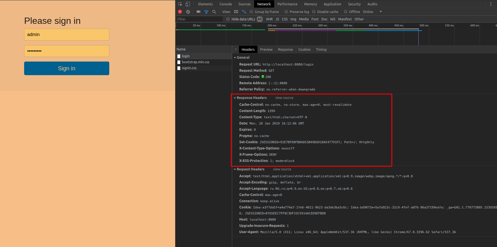
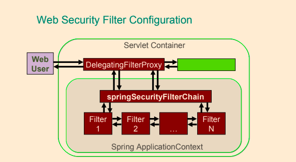
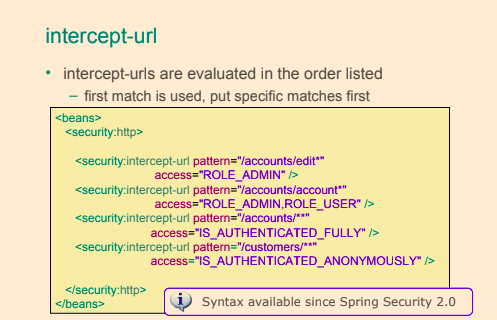
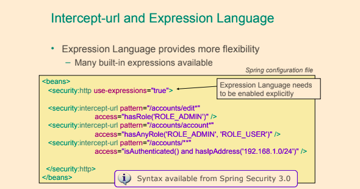
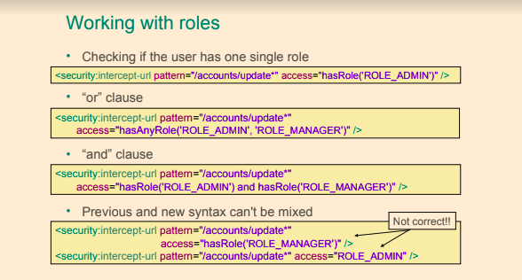
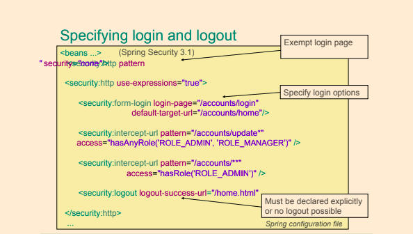

## Spring Security

- Tài liệu Spring Security nói rằng:
  **"Cơ sở hạ tầng web của Spring Security hoàn toàn dựa trên các bộ lọc servlet chuẩn. Nó không sử dụng servlets hay bất kỳ framework dựa trên servlet nào (như Spring MVC) nội bộ, vì vậy nó không có sự liên kết mạnh mẽ với bất kỳ công nghệ web cụ thể nào. Nó xử lý `HttpServletRequests` và `HttpServletResponses` và không quan tâm liệu yêu cầu đến từ trình duyệt, một client web service, một HttpInvoker hay một ứng dụng AJAX."**

### Các khái niệm

- **`Principal`** là thuật ngữ chỉ người dùng, thiết bị hoặc hệ thống có thể thực hiện một hành động trong ứng dụng.
- **`Credentials`** là các khóa xác thực mà principal sử dụng để xác minh danh tính của mình.
- **`Authentication`** là quá trình xác minh tính hợp lệ của thông tin xác thực của principal.
    - Xác thực luôn phải diễn ra trước khi cấp quyền.
    - Ví dụ là đăng nhập vào hệ thống máy tính; người dùng nhập tên đăng nhập và mật khẩu.
    - Các phương pháp xác thực khác có thể bao gồm mã PIN, câu hỏi bảo mật, thẻ ID, vân tay.
- **`Authorization`** là quá trình quyết định xem người dùng đã được xác thực có được phép thực hiện một hành động cụ thể trong ứng dụng hay không.
    - Ví dụ, chỉ những người dùng có vai trò quản trị viên mới có quyền tạo và xóa người dùng trong hệ thống máy tính. Do đó, chỉ những người dùng có vai trò quản trị viên mới có quyền truy cập các chức năng tạo và xóa trong ứng dụng.
- **`Secured`** là thuật ngữ dùng để mô tả bất kỳ tài nguyên nào đang được bảo vệ.

### Cách Spring bảo mật các yêu cầu web

- Spring bảo vệ các yêu cầu web bằng các bộ lọc chuẩn.
- Spring bảo vệ các lời gọi phương thức bằng cách sử dụng Spring AOP.

### Các cuộc tấn công phổ biến
- Kiểm soát bộ nhớ đệm (Cache Control)
- HTTPS
- XSS
- Content Sniffing
- Bảo vệ CSRF
- Session Fixation
- Click Jacking
- CSP
- RFD Attacks
- HttpFirewall

Hầu hết các cuộc tấn công đã được biết đến và được bảo vệ mặc định nếu sử dụng Spring Security.



### Các vai trò người dùng phổ biến
- **`ADMIN`** là vai trò có quyền hạn đầy đủ.
- **`MEMBER`** là vai trò với quyền hạn hạn chế.
- **`GUEST`** là vai trò với quyền sử dụng ứng dụng hạn chế.



### Quy trình xác thực và phân quyền

1. Người dùng cố gắng truy cập ứng dụng bằng cách gửi yêu cầu. Ứng dụng yêu cầu người dùng cung cấp thông tin xác thực để có thể đăng nhập.
2. Thông tin xác thực được xác minh bởi `Authentication Manager` và người dùng được cấp quyền truy cập vào ứng dụng. Quyền phân quyền cho người dùng này sẽ được tải vào ngữ cảnh Spring Security.
3. Người dùng gửi yêu cầu tài nguyên (xem, chỉnh sửa, chèn, hoặc xóa thông tin) và `Security Interceptor` sẽ chặn yêu cầu trước khi người dùng truy cập tài nguyên được bảo vệ.
4. `Security Interceptor` trích xuất dữ liệu phân quyền của người dùng từ ngữ cảnh bảo mật và...
5. ... chuyển quyết định đến `Access Decision Manager`.
6. `Access Decision Manager` lấy ý kiến từ danh sách các người bỏ phiếu (voters) để trả về quyết định về quyền truy cập của người dùng đã xác thực vào tài nguyên của hệ thống.
7. Quyền truy cập tài nguyên được cấp hoặc từ chối dựa trên quyền của người dùng và các thuộc tính của tài nguyên.

### Các cấu hình bảo mật phổ biến trong Spring Security

- **`<form-login ../>`**: Phần tử cấu hình được sử dụng để xác định URL yêu cầu cho trang đăng nhập nơi người dùng có thể cung cấp thông tin xác thực.
    - `<form-login login-page="/login.jsp" authentication-failure-url="/login.jsp?login_error=1"/>`

- **`<logout ../>`**: Phần tử cấu hình được sử dụng để xác định URL yêu cầu cho trang đăng xuất.
    - `<logout logout-success-url="/index.jsp"/>`

- **`<intercept-url …/>`**: Các đường dẫn được xác định là giá trị cho thuộc tính pattern là các đoạn URL.
- API `mvcMatchers` mới hơn API `antMatchers`.
    - Ví dụ, `antMatchers("/services")` chỉ khớp với URL “/services” chính xác, trong khi `mvcMatchers("/services")` khớp với “/services” nhưng cũng khớp với “/services/”, “/services.html” và “/services.abc”.
    - `mvcMatcher` khớp nhiều hơn `antMatcher` và dễ chịu hơn về lỗi cấu hình.
    - API `mvcMatchers` sử dụng các quy tắc khớp giống như quy tắc của chú thích `@RequestMapping`.

- **`<csrf disabled="true"/>`**: Sử dụng các mã thông báo CSRF trong các biểu mẫu của Spring để ngăn chặn tấn công giả mạo yêu cầu giữa các trang.
- **`authentication-failure-url`**: Dùng để xác định nơi người dùng sẽ được chuyển hướng khi có lỗi xác thực.
- **`default-target-url`**: Dùng để xác định nơi người dùng sẽ được chuyển hướng sau khi xác thực thành công.

### Cấu hình xác thực cho `UserDetailsService`

```xml
<authentication-manager>
        <authentication-provider>
            <user-service>
                <user name="john" password="doe"  authorities="ROLE_USER"/>
                <user name="jane" password="doe" authorities="ROLE_USER,ROLE_ADMIN"/>
                <user name="admin" password="admin" authorities="ROLE_ADMIN"/>
            </user-service>
        </authentication-provider>
</authentication-manager>
```

### Cấu hình `intercept-url`

- Một phần tử `<intercept-url>` duy nhất trong cấu hình XML của Spring Security 5 được sử dụng để chỉ định một mẫu URL trong ứng dụng và thông tin quyết định **ai sẽ có quyền truy cập tài nguyên(s) với các URL khớp với mẫu URL đó**.

```xml
<beans:beans  ...>
        <http>
              <intercept-url pattern="/services/users*" access="ROLE_ADMIN" />
              <intercept-url pattern="/users/edit" access="ROLE_ADMIN"/>
              <intercept-url pattern="/users/list" access="ROLE_USER"/>
              <intercept-url pattern="/users/**" access="IS_AUTHENTICATED_FULLY"/>
              <intercept-url pattern="/**" access="ROLE_USER" filters="none"/>
              <intercept-url pattern="/**" access="authenticated"/>
              <intercept-url pattern="/myPage.jsp*" access="ROLE_USER"/>
              <intercept-url pattern="/**" access="ROLE_USER,ROLE_ADMIN" />
              <intercept-url pattern="/**" requires-channel="http,https,any"/>
              <intercept-url pattern="/**" access="authenticated" method="POST" requires-channel="https" />
        </http>
</beans:beans> 
```







